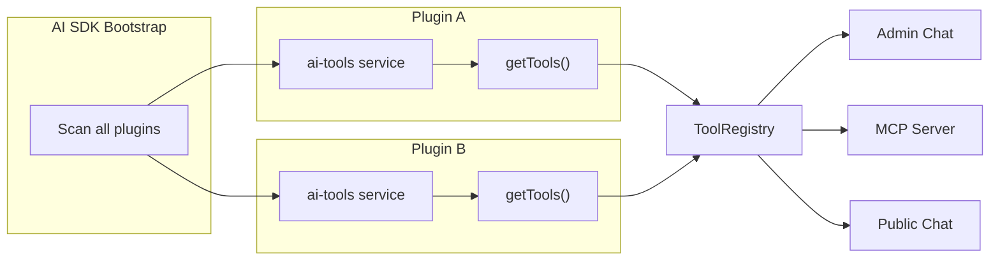
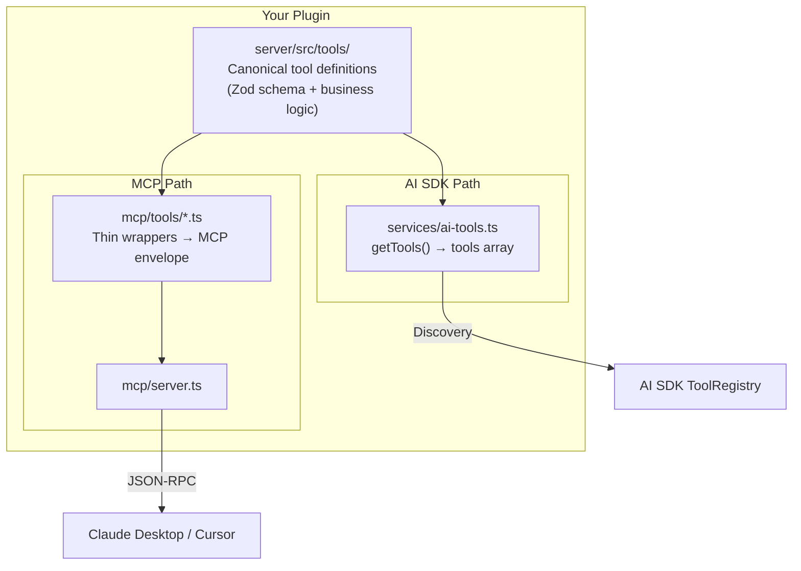

# Strapi Plugin AI SDK

A Strapi v5 plugin that adds an AI-powered chat assistant to the admin panel, exposes AI endpoints for frontend apps (Next.js, etc.), and provides an MCP server for external AI clients. Built on [Vercel AI SDK](https://ai-sdk.dev/) with [Anthropic Claude](https://www.anthropic.com/) as the default provider.

## Features

- **Admin Chat UI** with markdown rendering, tool call visualization, conversation history, and memory management
- **Content Tools** -- the AI can list content types, search content, create/update documents, and send emails
- **API Endpoints** -- `/ask`, `/ask-stream`, and `/chat` for frontend consumption (compatible with `useChat` from `@ai-sdk/react`)
- **Public Chat** -- sandboxed public-facing chat with read-only tools and a separate public memory store
- **Embeddable Widget** -- drop a single `<script>` tag on any website to add an AI chat bubble
- **MCP Server** -- expose tools to external AI clients (Claude Desktop, Cursor, etc.) via the Model Context Protocol
- **Guardrails** -- regex-based input safety middleware that blocks prompt injection, jailbreaks, and destructive commands
- **Extensible** -- register custom tools and AI providers at runtime

## Quick Start

### 1. Install and enable

In your Strapi project's `config/plugins.ts`:

```typescript
export default ({ env }) => ({
  'ai-sdk': {
    enabled: true,
    resolve: 'src/plugins/ai-sdk', // or the npm package path
    config: {
      anthropicApiKey: env('ANTHROPIC_API_KEY'),
      chatModel: env('ANTHROPIC_MODEL', 'claude-sonnet-4-20250514'),
    },
  },
});
```

### 2. Set environment variables

```bash
ANTHROPIC_API_KEY=sk-ant-your-api-key-here
ANTHROPIC_MODEL=claude-sonnet-4-20250514  # optional
```

### 3. Build and start

```bash
npm run build
npm run develop
```

### 4. Enable permissions

In the Strapi admin panel:

1. Go to **Settings > Users & Permissions > Roles**
2. Select **Public** (or your desired role)
3. Under **Ai-sdk**, enable `ask`, `askStream`, and `chat`
4. Save

## Embeddable Chat Widget

Add a floating AI chat bubble to **any website** with a single script tag. No npm install, no build step, no React required.

### 1. Enable the public chat endpoint

In the Strapi admin panel:

1. Go to **Settings > Users & Permissions > Roles > Public**
2. Under **Ai-sdk**, enable `publicChat` and `serveWidget`
3. Save

### 2. Add the script tag

```html
<script src="https://your-strapi-url.com/api/ai-sdk/widget.js"></script>
```

That's it. A floating chat button appears in the bottom-right corner. The widget auto-detects its Strapi URL from the script `src`.

### Configuration via data attributes

```html
<script
  src="https://your-strapi-url.com/api/ai-sdk/widget.js"
  data-api-token="your-api-token"
  data-system-prompt="You are a helpful assistant for our store."
></script>
```

| Attribute | Description |
|-----------|-------------|
| `data-api-token` | Optional API token for authenticated requests |
| `data-system-prompt` | Override the default system prompt |

### How it works

- The widget bundles React and AI SDK internally (~130KB gzipped)
- It renders inside a Shadow DOM so styles never conflict with your page
- It uses the `/api/ai-sdk/public-chat` endpoint which only exposes read-only tools

### Public Chat vs Admin Chat

| Feature | Admin Chat (`/chat`) | Public Chat (`/public-chat`) |
|---------|---------------------|------------------------------|
| Authentication | Admin JWT required | None (public endpoint) |
| Tools available | All tools (read + write) | Read-only tools only |
| Memory store | Per-user private memories | Shared public memories |
| Content access | All content types | Only configured `allowedContentTypes` |

### Configuring public chat

In `config/plugins.ts`, add `publicChat` with the content types visitors can query:

```typescript
'ai-sdk': {
  enabled: true,
  config: {
    anthropicApiKey: env('ANTHROPIC_API_KEY'),
    publicChat: {
      chatModel: 'claude-haiku-4-5-20251001', // optional: use a cheaper model for public chat
      allowedContentTypes: [
        'api::article.article',
        'api::category.category',
        'api::product.product',
      ],
    },
  },
},
```

If `allowedContentTypes` is an empty array, public chat will have no access to content.

### Managing public memories

Public memories are facts the AI knows when talking to visitors (e.g., "Our return policy is 30 days"). Manage them from the Strapi admin panel:

1. Go to the **AI SDK** plugin page
2. Click the globe icon in the chat toolbar
3. Add, edit, or delete public memories with categories: General, FAQ, Product, Policy

## Configuration

All plugin settings go in `config/plugins.ts` under the `ai-sdk` key:

```typescript
export default ({ env }) => ({
  'ai-sdk': {
    enabled: true,
    config: {
      // AI Provider (required)
      anthropicApiKey: env('ANTHROPIC_API_KEY'),
      provider: 'anthropic',                        // default
      chatModel: 'claude-sonnet-4-20250514',        // default
      baseURL: undefined,                           // custom API base URL

      // System Prompt (optional)
      systemPrompt: 'You are a helpful CMS assistant.\n\n{tools}',

      // MCP Session Tuning (optional)
      mcp: {
        sessionTimeoutMs: 4 * 60 * 60 * 1000,      // 4 hours (default)
        maxSessions: 100,                            // default
        cleanupInterval: 100,                        // cleanup every N requests
      },

      // Public Chat (optional)
      publicChat: {
        chatModel: 'claude-haiku-4-5-20251001',     // optional cheaper model
        allowedContentTypes: ['api::article.article'],
      },

      // Guardrails (optional)
      guardrails: {
        enabled: true,                               // default
        maxInputLength: 10000,                       // default
        additionalPatterns: [],                      // extra regex patterns
        disableDefaultPatterns: false,                // use only your own patterns
        blockedMessage: 'Custom blocked message.',   // override default message
      },
    },
  },
});
```

### Supported Claude Models

- `claude-sonnet-4-20250514` (default)
- `claude-opus-4-20250514`
- `claude-haiku-4-5-20251001`
- `claude-3-5-sonnet-20241022`
- `claude-3-5-haiku-20241022`

## API Endpoints

### Content API (for frontend apps)

| Method | Endpoint | Description |
|--------|----------|-------------|
| `POST` | `/api/ai-sdk/ask` | Non-streaming text generation |
| `POST` | `/api/ai-sdk/ask-stream` | Streaming text via Server-Sent Events |
| `POST` | `/api/ai-sdk/chat` | Chat with AI SDK UI message stream protocol |
| `POST` | `/api/ai-sdk/public-chat` | Public chat with read-only tools and public memories |
| `GET` | `/api/ai-sdk/widget.js` | Embeddable chat widget script |
| `POST` | `/api/ai-sdk/mcp` | MCP JSON-RPC requests |
| `GET` | `/api/ai-sdk/mcp` | MCP session management |
| `DELETE` | `/api/ai-sdk/mcp` | MCP session cleanup |

### Admin API (admin panel only)

| Method | Endpoint | Description |
|--------|----------|-------------|
| `POST` | `/ai-sdk/chat` | Admin chat with full tool access |

All routes with user input are protected by the guardrail middleware.

### POST `/api/ai-sdk/ask`

Generate a text response (non-streaming).

**Request:**

```json
{
  "prompt": "What is the capital of France?",
  "system": "You are a helpful geography assistant."
}
```

| Field | Type | Required | Description |
|-------|------|----------|-------------|
| `prompt` | string | Yes | The user's question or prompt |
| `system` | string | No | System prompt override |

**Response:**

```json
{
  "data": {
    "text": "The capital of France is Paris."
  }
}
```

### POST `/api/ai-sdk/ask-stream`

Streaming text generation via Server-Sent Events.

**Request:** Same as `/ask`

**Response:** SSE stream

```
data: {"text":"The"}
data: {"text":" capital"}
data: {"text":" of France is Paris."}
data: [DONE]
```

### POST `/api/ai-sdk/chat`

Chat endpoint using the AI SDK UI message stream protocol. Compatible with the `useChat` hook from `@ai-sdk/react`. Supports multi-turn conversation with tool calling.

**Request:**

```json
{
  "messages": [
    { "role": "user", "content": "Hello!" },
    { "role": "assistant", "content": "Hi there! How can I help you?" },
    { "role": "user", "content": "List all my content types" }
  ],
  "system": "You are a helpful assistant."
}
```

| Field | Type | Required | Description |
|-------|------|----------|-------------|
| `messages` | array | Yes | Array of message objects with `role` and `content` |
| `system` | string | No | System prompt override |

**Response:** UI message stream (`x-vercel-ai-ui-message-stream: v1` protocol) with text deltas and tool call events.

## Built-in Tools

The AI assistant has access to these tools. Tools marked as **public** are also exposed via MCP.

| Tool | MCP Name | Description |
|------|----------|-------------|
| `listContentTypes` | `list_content_types` | List all Strapi content types and components with their fields and relations |
| `searchContent` | `search_content` | Search and query any content type with filters, sorting, and pagination |
| `aggregateContent` | `aggregate_content` | Count, group, and analyze content (faster than searchContent for analytics) |
| `writeContent` | `write_content` | Create or update documents in any content type |
| `sendEmail` | `send_email` | Send emails via the configured email provider (e.g. Resend) |

Additionally, the AI SDK automatically discovers tools from other installed plugins (see [Extending the Plugin](#adding-tools-from-other-plugins-convention-based-discovery)). For example, with the mentions and embeddings plugins installed, the AI also has access to `searchMentions`, `semanticSearch`, `ragQuery`, and more.

### Tool Details

**searchContent** parameters: `contentType` (required), `query`, `filters`, `fields`, `sort`, `page`, `pageSize` (max 50)

**writeContent** parameters: `contentType` (required), `action` (`create` or `update`), `documentId` (required for update), `data` (required), `status` (`draft` or `published`)

**sendEmail** parameters: `to` (required), `subject` (required), `html` (required), `text`, `cc`, `bcc`, `replyTo`. The tool always confirms the recipient with the user before sending. See [docs/sending-emails-with-resend.md](./docs/sending-emails-with-resend.md) for setup.

## MCP Server

The plugin exposes an [MCP](https://modelcontextprotocol.io/) server at `/api/ai-sdk/mcp` that lets external AI clients call the public tools directly.

### How It Works

- Sessions are created on first request and identified by the `mcp-session-id` header
- Tool names are converted from camelCase to snake_case (`listContentTypes` -> `list_content_types`)
- Sessions expire after the configured timeout (default: 4 hours)
- Maximum concurrent sessions can be configured (default: 100)

### Connecting from Claude Desktop

Add to your Claude Desktop MCP config:

```json
{
  "mcpServers": {
    "strapi": {
      "url": "http://localhost:1337/api/ai-sdk/mcp"
    }
  }
}
```

### Connecting from Cursor

Add to your Cursor MCP settings:

```json
{
  "mcpServers": {
    "strapi": {
      "url": "http://localhost:1337/api/ai-sdk/mcp"
    }
  }
}
```

## Guardrails

The plugin includes a guardrail middleware that checks all user input before it reaches the AI. It runs on every AI endpoint (`/ask`, `/ask-stream`, `/chat`, `/mcp`).

### What It Catches

- **Prompt injection** -- "ignore all previous instructions", "override your rules"
- **Jailbreak attempts** -- "you are now in developer mode", "DAN mode"
- **System prompt extraction** -- "reveal your system prompt", "what were you told"
- **System prompt mimicry** -- fake `[SYSTEM]:` delimiters injected in user input
- **Destructive commands** -- "delete all content", "drop table", "rm -rf"

### How It Works

1. Extract user input (adapts to request shape: messages, prompt, or JSON-RPC params)
2. Run optional `beforeProcess` hook (for custom logic like external moderation APIs)
3. Normalize text (NFKC, strip zero-width characters, collapse whitespace)
4. Match against compiled regex patterns
5. Check input length (default max: 10,000 characters)

Blocked requests return route-aware responses: chat routes get an SSE message (renders naturally in the UI), API routes get a 403 JSON error.

For full details, pattern lists, and the `beforeProcess` hook API, see [docs/guardrails.md](./docs/guardrails.md).

## Frontend Integration (Next.js)

### Using `useChat` (Recommended)

The `/chat` endpoint is fully compatible with the `useChat` hook from `@ai-sdk/react`:

```bash
npm install @ai-sdk/react
```

```tsx
'use client';

import { useChat } from '@ai-sdk/react';

export default function Chat() {
  const { messages, input, handleInputChange, handleSubmit, isLoading } = useChat({
    api: 'http://localhost:1337/api/ai-sdk/chat',
  });

  return (
    <div>
      <div>
        {messages.map((message) => (
          <div key={message.id}>
            <strong>{message.role}:</strong> {message.content}
          </div>
        ))}
      </div>

      <form onSubmit={handleSubmit}>
        <input
          value={input}
          onChange={handleInputChange}
          placeholder="Type a message..."
          disabled={isLoading}
        />
        <button type="submit" disabled={isLoading}>
          {isLoading ? 'Sending...' : 'Send'}
        </button>
      </form>
    </div>
  );
}
```

### Non-streaming request

```typescript
const response = await fetch('http://localhost:1337/api/ai-sdk/ask', {
  method: 'POST',
  headers: { 'Content-Type': 'application/json' },
  body: JSON.stringify({
    prompt: 'Explain quantum computing in simple terms',
  }),
});

const { data } = await response.json();
console.log(data.text);
```

### Streaming request

```typescript
const response = await fetch('http://localhost:1337/api/ai-sdk/ask-stream', {
  method: 'POST',
  headers: { 'Content-Type': 'application/json' },
  body: JSON.stringify({ prompt: 'Write a short story about a robot' }),
});

const reader = response.body.getReader();
const decoder = new TextDecoder();

while (true) {
  const { done, value } = await reader.read();
  if (done) break;

  const chunk = decoder.decode(value, { stream: true });
  const lines = chunk.split('\n').filter(line => line.startsWith('data: '));

  for (const line of lines) {
    const data = line.replace('data: ', '');
    if (data === '[DONE]') continue;
    const { text } = JSON.parse(data);
    process.stdout.write(text);
  }
}
```

### cURL

```bash
# Non-streaming
curl -X POST http://localhost:1337/api/ai-sdk/ask \
  -H "Content-Type: application/json" \
  -d '{"prompt": "Hello, how are you?"}'

# Streaming
curl -N -X POST http://localhost:1337/api/ai-sdk/ask-stream \
  -H "Content-Type: application/json" \
  -d '{"prompt": "Count from 1 to 10"}'
```

## Extending the Plugin

### Adding Tools from Other Plugins (Convention-Based Discovery)

Any Strapi plugin can contribute tools to the AI SDK by exposing an `ai-tools` service with a `getTools()` method. The AI SDK discovers these automatically at boot time -- no configuration required.



#### How It Works

1. On startup, the AI SDK scans every loaded plugin for an `ai-tools` service
2. If found, it calls `getTools()` which returns an array of `ToolDefinition` objects
3. Each tool is namespaced as `pluginName__toolName` (e.g., `octalens_mentions__searchMentions`) to prevent collisions
4. Discovered tools are registered in the shared `ToolRegistry` alongside built-in tools
5. All registered tools are available in admin chat, public chat (if `publicSafe: true`), and MCP

#### Creating an `ai-tools` Service in Your Plugin

**1. Define canonical tools** in `server/src/tools/`:

```typescript
// server/src/tools/my-tool.ts
import { z } from 'zod';
import type { Core } from '@strapi/strapi';

const schema = z.object({
  query: z.string().describe('Search query'),
  limit: z.number().min(1).max(50).optional().default(10).describe('Max results'),
});

export const mySearchTool = {
  name: 'mySearch',
  description: 'Search my plugin data with relevance ranking.',
  schema,
  execute: async (args: z.infer<typeof schema>, strapi: Core.Strapi) => {
    const validated = schema.parse(args);
    const results = await strapi.documents('plugin::my-plugin.item' as any).findMany({
      filters: { title: { $containsi: validated.query } },
      limit: validated.limit,
    });
    return { results, total: results.length };
  },
  publicSafe: true, // available in public chat (read-only operations)
};
```

**2. Create the `ai-tools` service:**

```typescript
// server/src/services/ai-tools.ts
import type { Core } from '@strapi/strapi';
import { tools } from '../tools';

export default ({ strapi }: { strapi: Core.Strapi }) => ({
  getTools() {
    return tools;
  },
});
```

**3. Register the service:**

```typescript
// server/src/services/index.ts
import myService from './my-service';
import aiTools from './ai-tools';

export default {
  'my-service': myService,
  'ai-tools': aiTools,
};
```

That's it. The AI SDK will discover and register your tools on the next Strapi restart.

#### ToolDefinition Interface

```typescript
interface ToolDefinition {
  name: string;                    // camelCase, unique within your plugin
  description: string;             // Clear description for the AI model
  schema: z.ZodObject<any>;        // Zod schema for parameter validation
  execute: (args: any, strapi: Core.Strapi, context?: ToolContext) => Promise<unknown>;
  internal?: boolean;              // If true, hidden from MCP (AI chat only)
  publicSafe?: boolean;            // If true, available in public/widget chat
}
```

#### Canonical Architecture Pattern

The recommended pattern is to define tools once in `server/src/tools/` and consume them from both the AI SDK service and MCP handlers:



This eliminates duplication -- business logic lives in one place, and each consumer (AI SDK, MCP) uses a thin adapter.

#### Real-World Examples

Two plugins already use this pattern:

**[strapi-octolens-mentions-plugin](../strapi-octolens-mentions-plugin/)** -- Contributes 4 tools: `searchMentions` (BM25 relevance search), `listMentions`, `getMention`, `updateMention`

**[strapi-content-embeddings](../strapi-content-embeddings/)** -- Contributes 5 tools: `semanticSearch` (vector similarity), `ragQuery` (RAG), `listEmbeddings`, `getEmbedding`, `createEmbedding`

### Adding a Custom Tool (Without a Plugin)

**Option A: Inside the plugin** -- create files in `tools/definitions/` and `tool-logic/`, add to the `builtInTools` array.

**Option B: At runtime from your Strapi app:**

```typescript
// src/index.ts (your Strapi app)
import { z } from 'zod';

export default {
  bootstrap({ strapi }) {
    const plugin = strapi.plugin('ai-sdk');
    plugin.toolRegistry.register({
      name: 'analyzeContent',
      description: 'Analyze content quality and suggest improvements',
      schema: z.object({
        contentType: z.string().describe('Content type UID'),
        documentId: z.string().describe('Document ID to analyze'),
      }),
      execute: async (args, strapi) => {
        const doc = await strapi.documents(args.contentType).findOne({
          documentId: args.documentId,
        });
        return { score: 85, suggestions: ['Add more headings'] };
      },
    });
  },
};
```

The tool is automatically available in AI chat and MCP (unless `internal: true`). No changes to `tools/index.ts` or `mcp/server.ts` needed.

### Adding an AI Provider

```typescript
// src/index.ts (your Strapi app)
import { createOpenAI } from '@ai-sdk/openai';

export default {
  register({ strapi }) {
    const { AIProvider } = require('strapi-plugin-ai-sdk/server');
    AIProvider.registerProvider('openai', ({ apiKey, baseURL }) => {
      const provider = createOpenAI({ apiKey, baseURL });
      return (modelId) => provider(modelId);
    });
  },
};
```

Then set `provider: 'openai'` and `chatModel: 'gpt-4o'` in config.

### Customizing the System Prompt

```typescript
// config/plugins.ts
config: {
  // Simple replacement (tool descriptions appended automatically)
  systemPrompt: 'You are a friendly content editor for our blog platform.',

  // Or use {tools} placeholder for precise placement
  systemPrompt: `You are a blog assistant.

RULES:
- Always use friendly language
- Never create content without confirmation

{tools}

When listing content types, summarize them in a table.`,
}
```

Per-request `system` overrides in the request body take priority over the configured `systemPrompt`.

## Admin Panel Features

The plugin adds a chat interface to the Strapi admin panel with:

- **Chat UI** -- message list with markdown rendering, tool call visualization, and typing indicator
- **Conversation History** -- persistent conversations stored per-user, accessible via the sidebar
- **Memory Management** -- the AI remembers facts across conversations; view and manage memories from the toolbar
- **Public Memory Store** -- shared facts available to public chat visitors (FAQ, policies, etc.)
- **Tool Call Display** -- collapsible viewer showing tool inputs and outputs inline in the chat
- **Widget Preview** -- live preview of the embeddable chat widget with copy-paste embed code

## Error Handling

| Error | Cause | Solution |
|-------|-------|----------|
| `prompt is required` | Missing prompt in request | Include `prompt` in request body |
| `AI SDK not initialized` | Missing API key | Check `ANTHROPIC_API_KEY` in `.env` |
| `403 Forbidden` | Permissions not enabled | Enable permissions in Strapi admin |
| `Request blocked by guardrails` | Input matched a safety pattern | Rephrase the prompt |

Error response format:

```json
{
  "error": {
    "status": 400,
    "name": "BadRequestError",
    "message": "prompt is required and must be a string"
  }
}
```

## Project Structure

```
server/src/
  index.ts                    # Server entry point
  register.ts                 # Plugin register lifecycle
  bootstrap.ts                # Initialize providers, tools, MCP, plugin tool discovery
  destroy.ts                  # Graceful shutdown
  config/index.ts             # Plugin config defaults
  guardrails/                 # Input safety middleware
  lib/
    ai-provider.ts            # AIProvider with static provider registry
    tool-registry.ts          # ToolRegistry class
    types.ts                  # Shared types
    utils.ts                  # Controller helpers
  controllers/
    controller.ts             # ask, askStream, chat, publicChat, serveWidget handlers
    public-memory.ts          # CRUD for public memories
    mcp.ts                    # MCP session management
  services/service.ts         # AI service facade
  routes/
    content-api/index.ts      # Public API routes
    admin/index.ts            # Admin routes
  tools/
    index.ts                  # Bridge: registry -> AI SDK ToolSet
    definitions/              # Tool definitions (schema + execute wrapper)
  tool-logic/                 # Pure business logic (shared by AI SDK + MCP)
  mcp/
    server.ts                 # MCP server factory
    utils/sanitize.ts         # Content API sanitization

admin/src/
  pages/                      # App router, HomePage, WidgetPreviewPage, MemoryStorePage
  components/
    Chat.tsx                  # Chat orchestrator
    MessageList.tsx           # Message rendering with markdown
    ChatInput.tsx             # Input area
    ToolCallDisplay.tsx       # Tool call viewer
    ConversationSidebar.tsx   # Conversation history panel
    MemoryPanel.tsx           # Memory management panel
  hooks/
    useChat.ts                # Chat state + SSE streaming
    useConversations.ts       # Conversation CRUD
    useMemories.ts            # Memory CRUD

widget/src/                     # Embeddable chat widget (separate Vite build)
  embed.tsx                     # Auto-mount entry (Shadow DOM)
  react.tsx                     # React component export
  auto-detect.ts                # Script URL detection
  styles.css                    # Scoped CSS (no Tailwind)
  components/strapi-chat.tsx    # Chat UI component

tests/                          # E2E integration tests
docs/                           # Architecture + guardrails + email guides
```

## Testing

The plugin uses end-to-end integration tests against a running Strapi instance:

```bash
npm run test:guardrails    # Guardrail safety tests (42 assertions)
npm run test:api           # /ask and /ask-stream endpoint tests
npm run test:stream        # Streaming visual test
npm run test:chat          # Chat protocol test
npm run test:ts:back       # Server TypeScript type checking (no Strapi needed)
npm run test:ts:front      # Admin TypeScript type checking (no Strapi needed)
```

With authentication:

```bash
STRAPI_TOKEN=your-api-token npm run test:guardrails
```

## Documentation

- [Architecture](./docs/architecture.md) -- full system architecture, data flows, extension guides
- [Plugin Tool Discovery](./docs/plugin-tool-discovery.md) -- cross-plugin tool discovery architecture and implementation
- [Tool Standardization Spec](./docs/tool-standardization-spec.md) -- canonical tool format, Zod-first vs MCP-native comparison, portability
- [Guardrails](./docs/guardrails.md) -- guardrail system, pattern lists, `beforeProcess` hook API
- [Sending Emails with Resend](./docs/sending-emails-with-resend.md) -- Resend setup, email tool, domain verification

## License

MIT
