# AI SDK Plugin Architecture

A comprehensive guide to the Strapi v5 plugin that embeds an AI chat interface, MCP server, TTS synthesis, and animated 3D avatar into the Strapi admin panel.

---

## Table of Contents

- [High-Level Overview](#high-level-overview)
- [System Architecture](#system-architecture)
- [Plugin Lifecycle](#plugin-lifecycle)
- [Server-Side Architecture](#server-side-architecture)
  - [Configuration](#configuration)
  - [Guardrails Middleware](#guardrails-middleware)
  - [AI Provider Factory](#ai-provider-factory)
  - [Tool Registry](#tool-registry)
  - [TTS Provider Registry](#tts-provider-registry)
  - [Tool Logic Layer](#tool-logic-layer)
  - [Services](#services)
  - [Controllers & Routes](#controllers--routes)
  - [MCP Server](#mcp-server)
- [Admin-Side Architecture](#admin-side-architecture)
  - [Component Tree](#component-tree)
  - [Chat Component Split](#chat-component-split)
  - [Hooks](#hooks)
  - [Avatar 3D System](#avatar-3d-system)
  - [Animation System](#animation-system)
- [Data Flows](#data-flows)
  - [Chat Request Flow](#chat-request-flow)
  - [MCP Request Flow](#mcp-request-flow)
  - [Voice Mode Flow](#voice-mode-flow)
  - [Animation Flow](#animation-flow)
- [Extending the Plugin](#extending-the-plugin)
  - [Adding a Custom Tool](#adding-a-custom-tool)
  - [Adding an AI Provider](#adding-an-ai-provider)
  - [Adding a TTS Provider](#adding-a-tts-provider)
  - [Customizing the System Prompt](#customizing-the-system-prompt)
  - [Tuning MCP Session Limits](#tuning-mcp-session-limits)
- [Testing](#testing)
  - [Test Scripts](#test-scripts)
  - [Testing Methodology](#testing-methodology)
  - [Running Tests](#running-tests)
- [File Reference](#file-reference)

---

## High-Level Overview

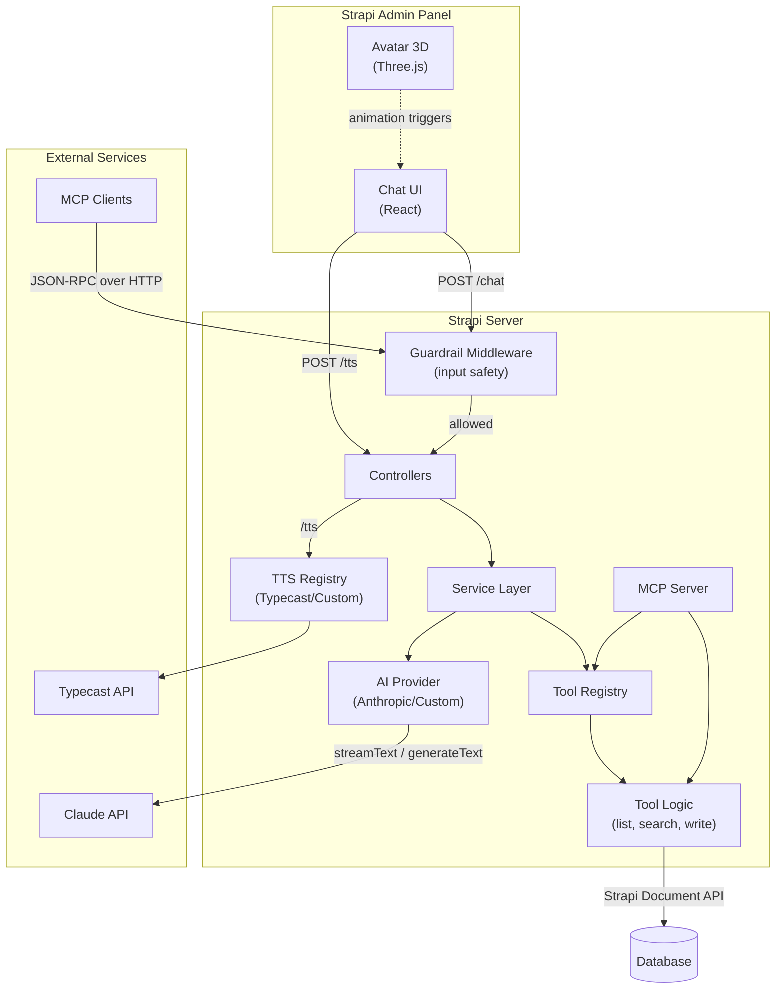
```mermaid
graph TB
    subgraph Admin["Strapi Admin Panel"]
        UI["Chat UI<br/>(React)"]
        Avatar["Avatar 3D<br/>(Three.js)"]
    end

    subgraph Server["Strapi Server"]
        Guardrail["Guardrail Middleware<br/>(input safety)"]
        Controller["Controllers"]
        Service["Service Layer"]
        AIProvider["AI Provider<br/>(Anthropic/Custom)"]
        ToolReg["Tool Registry"]
        MCP["MCP Server"]
        TTS["TTS Registry<br/>(Typecast/Custom)"]
        ToolLogic["Tool Logic<br/>(list, search, write)"]
    end

    subgraph External["External Services"]
        Claude["Claude API"]
        TypecastAPI["Typecast API"]
        MCPClient["MCP Clients"]
    end

    UI -->|"POST /chat"| Guardrail
    UI -->|"POST /tts"| Controller
    Guardrail -->|"allowed"| Controller
    Controller --> Service
    Service --> AIProvider
    Service --> ToolReg
    AIProvider -->|"streamText / generateText"| Claude
    ToolReg --> ToolLogic
    ToolLogic -->|"Strapi Document API"| DB[(Database)]
    Controller -->|"/tts"| TTS
    TTS --> TypecastAPI
    MCPClient -->|"JSON-RPC over HTTP"| Guardrail
    MCP --> ToolReg
    MCP --> ToolLogic
    Avatar -.->|"animation triggers"| UI
```

---

## System Architecture


```mermaid
graph LR
    subgraph Plugin["Plugin Instance (runtime)"]
        direction TB
        AI["aiProvider: AIProvider"]
        TR["toolRegistry: ToolRegistry"]
        TTSR["ttsRegistry: TTSRegistry"]
        TTSP["ttsProvider: TTSProvider"]
        MCPFactory["createMcpServer: () => McpServer"]
        Sessions["mcpSessions: Map&lt;string, MCPSession&gt;"]
    end

    subgraph Registries["Registry Pattern"]
        direction TB
        AIReg["AIProvider.registerProvider()"]
        ToolRegR["toolRegistry.register()"]
        TTSRegR["ttsRegistry.register()"]
    end

    Registries -->|"populated in bootstrap"| Plugin
```

The plugin stores all runtime state on the Strapi plugin instance (`strapi.plugin('ai-sdk')`), typed as `PluginInstance`:

```typescript
interface PluginInstance {
  aiProvider?: AIProvider;
  ttsProvider?: TTSProvider;
  ttsRegistry?: TTSRegistry;
  toolRegistry?: ToolRegistry;
  createMcpServer?: (() => McpServer) | null;
  mcpSessions?: Map<string, MCPSession> | null;
}
```

---

## Plugin Lifecycle

```mermaid
sequenceDiagram
    participant Strapi
    participant Register
    participant Bootstrap
    participant Runtime
    participant Destroy

    Strapi->>Register: register()
    Note over Register: No-op (deferred to bootstrap)

    Strapi->>Bootstrap: bootstrap({ strapi })
    Bootstrap->>Bootstrap: Register AI provider factory
    Bootstrap->>Bootstrap: Initialize AIProvider
    Bootstrap->>Bootstrap: Create ToolRegistry + register 4 built-in tools
    Bootstrap->>Bootstrap: Store MCP factory + sessions map
    Bootstrap->>Bootstrap: Create TTSRegistry + init TTS if configured
    Note over Bootstrap: Plugin instance fully populated

    Bootstrap->>Runtime: Plugin ready
    Note over Runtime: Handles requests...

    Strapi->>Destroy: destroy({ strapi })
    Destroy->>Destroy: aiProvider.destroy()
    Destroy->>Destroy: Close all MCP sessions
    Destroy->>Destroy: Null out all references
```

### Bootstrap Order

The bootstrap function initializes systems in dependency order:

```typescript
// 1. Register provider factory (static, no config needed)
AIProvider.registerProvider('anthropic', ({ apiKey, baseURL }) => {
  const provider = createAnthropic({ apiKey, baseURL });
  return (modelId: string) => provider(modelId);
});

// 2. Initialize AI provider (needs config + registered factory)
const aiProvider = new AIProvider();
aiProvider.initialize(config);
plugin.aiProvider = aiProvider;

// 3. Initialize tool registry — loop over tools/definitions/
const toolRegistry = new ToolRegistry();
for (const tool of builtInTools) {
  toolRegistry.register(tool);
}
plugin.toolRegistry = toolRegistry;

// 4. Store MCP factory (needs toolRegistry to be set on plugin)
plugin.createMcpServer = () => createMcpServer(strapi);
plugin.mcpSessions = new Map();

// 5. Initialize TTS (independent)
const ttsRegistry = createTTSRegistry();
plugin.ttsRegistry = ttsRegistry;
```

---

## Server-Side Architecture

### Configuration

All plugin settings are defined in `config/index.ts` with sensible defaults:

```typescript
interface PluginConfig {
  anthropicApiKey: string;       // Required for AI features
  provider?: string;             // AI provider name (default: 'anthropic')
  chatModel?: string;            // Model ID (default: 'claude-sonnet-4-20250514')
  baseURL?: string;              // Custom API base URL
  systemPrompt?: string;         // Custom system prompt (supports {tools} placeholder)
  typecastApiKey?: string;       // For TTS
  typecastActorId?: string;      // For TTS
  mcp?: MCPConfig;               // MCP session tuning
  guardrails?: GuardrailConfig;  // Input safety guardrails
}

interface MCPConfig {
  sessionTimeoutMs?: number;     // Default: 4 hours
  maxSessions?: number;          // Default: 100
  cleanupInterval?: number;      // Cleanup every N requests (default: 100)
}
```

Configure in your Strapi `config/plugins.ts`:

```typescript
export default {
  'ai-sdk': {
    enabled: true,
    config: {
      anthropicApiKey: env('ANTHROPIC_API_KEY'),
      chatModel: 'claude-sonnet-4-20250514',
      systemPrompt: 'You are a helpful CMS assistant.\n\n{tools}',
      mcp: {
        maxSessions: 50,
        sessionTimeoutMs: 2 * 60 * 60 * 1000, // 2 hours
      },
    },
  },
};
```

---

### Guardrails Middleware

The guardrail middleware intercepts all AI requests before they reach the controller. It runs as a Strapi route middleware registered on every AI endpoint (`/ask`, `/ask-stream`, `/chat`, `/mcp`).

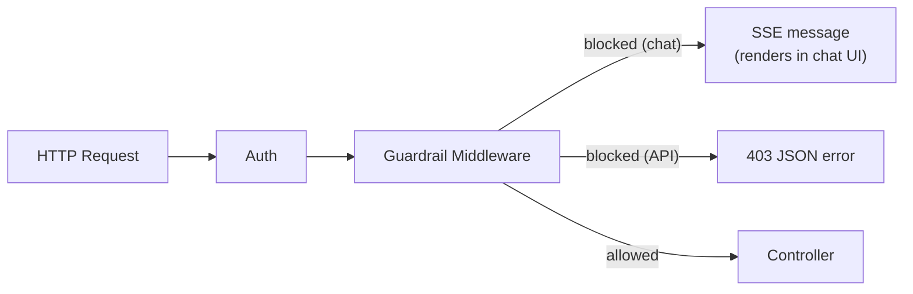
```mermaid
graph LR
    Request["HTTP Request"] --> Auth["Auth"]
    Auth --> Guardrail["Guardrail Middleware"]
    Guardrail -->|"blocked (chat)"| SSE["SSE message<br/>(renders in chat UI)"]
    Guardrail -->|"blocked (API)"| JSON["403 JSON error"]
    Guardrail -->|"allowed"| Controller["Controller"]
```

**Pipeline steps (per request):**

1. **Extract input** -- adapts to request shape (`messages[]`, `prompt`, JSON-RPC `params`)
2. **Custom hook** -- `beforeProcess` runs first (if configured)
3. **Normalize** -- NFKC, strip zero-width chars, collapse whitespace
4. **Pattern match** -- regex patterns from `default-patterns.json` + user config
5. **Length check** -- reject if over `maxInputLength` (default: 10,000)

Patterns are compiled once at startup, not per-request. The middleware produces route-aware responses: chat routes get an SSE stream (so the UI renders a natural assistant message), while API routes get a structured 403 JSON error.

**Default pattern categories:** prompt injection, jailbreak, system prompt extraction, system prompt mimicry, destructive commands.

For full details, configuration examples, and the `beforeProcess` hook API, see [docs/guardrails.md](./guardrails.md).

---

### AI Provider Factory

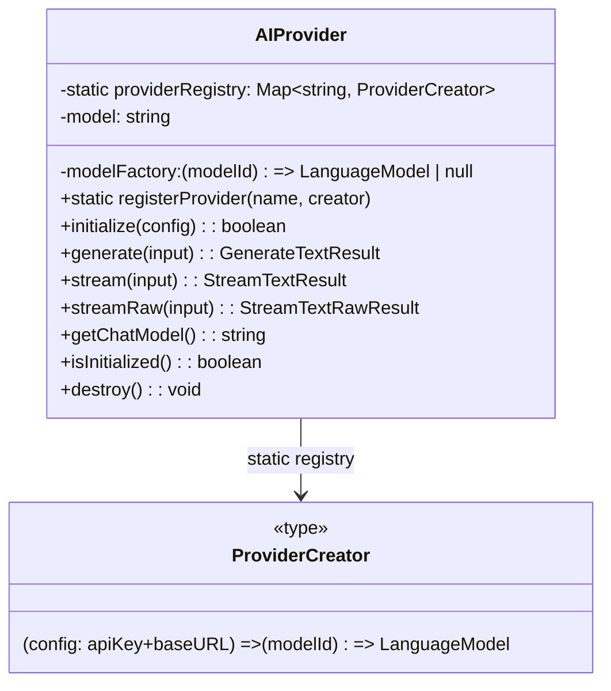
```mermaid
classDiagram
    class AIProvider {
        -static providerRegistry: Map~string, ProviderCreator~
        -modelFactory: (modelId) => LanguageModel | null
        -model: string
        +static registerProvider(name, creator)
        +initialize(config): boolean
        +generate(input): GenerateTextResult
        +stream(input): StreamTextResult
        +streamRaw(input): StreamTextRawResult
        +getChatModel(): string
        +isInitialized(): boolean
        +destroy(): void
    }

    class ProviderCreator {
        <<type>>
        (config: apiKey+baseURL) => (modelId) => LanguageModel
    }

    AIProvider --> ProviderCreator : static registry
```

The `AIProvider` uses a **static registry** for provider factories and **instance state** for the active model:

```typescript
// Registration (in bootstrap, before initialize)
AIProvider.registerProvider('anthropic', ({ apiKey, baseURL }) => {
  const provider = createAnthropic({ apiKey, baseURL });
  return (modelId: string) => provider(modelId);
});

// Initialization (reads provider name from config)
const aiProvider = new AIProvider();
aiProvider.initialize(config); // looks up config.provider ?? 'anthropic'
```

**Adding a custom provider** (e.g., OpenAI):

```typescript
import { createOpenAI } from '@ai-sdk/openai';

AIProvider.registerProvider('openai', ({ apiKey, baseURL }) => {
  const provider = createOpenAI({ apiKey, baseURL });
  return (modelId: string) => provider(modelId);
});
```

Then set `provider: 'openai'` and `chatModel: 'gpt-4o'` in config.

---

### Tool Registry

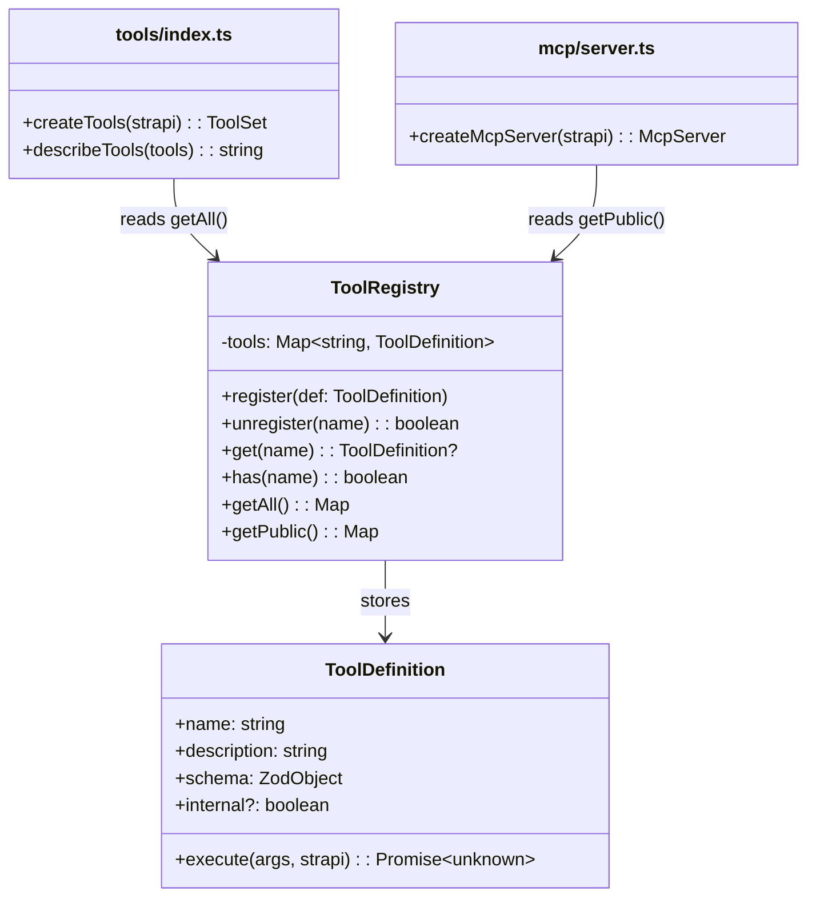
```mermaid
classDiagram
    class ToolRegistry {
        -tools: Map~string, ToolDefinition~
        +register(def: ToolDefinition)
        +unregister(name): boolean
        +get(name): ToolDefinition?
        +has(name): boolean
        +getAll(): Map
        +getPublic(): Map
    }

    class ToolDefinition {
        +name: string
        +description: string
        +schema: ZodObject
        +execute(args, strapi): Promise~unknown~
        +internal?: boolean
    }

    ToolRegistry --> ToolDefinition : stores

    class AISDKTools["tools/index.ts"] {
        +createTools(strapi): ToolSet
        +describeTools(tools): string
    }

    class MCPServer["mcp/server.ts"] {
        +createMcpServer(strapi): McpServer
    }

    AISDKTools --> ToolRegistry : reads getAll()
    MCPServer --> ToolRegistry : reads getPublic()
```

The `ToolRegistry` is the central source of truth for all tools. Two consumers read from it:

| Consumer | Method | Tools Included |
|----------|--------|----------------|
| `tools/index.ts` (AI SDK chat) | `getAll()` | All tools (including `internal: true`) |
| `mcp/server.ts` (MCP endpoint) | `getPublic()` | Only non-internal tools |

**Built-in tools:**

| Name | Internal | Description |
|------|----------|-------------|
| `listContentTypes` | No | List all Strapi content types and components |
| `searchContent` | No | Search/query any content type |
| `writeContent` | No | Create or update documents |
| `triggerAnimation` | Yes | Trigger 3D avatar animation (chat-only) |

**Tool name conversion for MCP:**

The MCP server converts camelCase tool names to snake_case:
- `listContentTypes` -> `list_content_types`
- `searchContent` -> `search_content`
- `writeContent` -> `write_content`

---

### TTS Provider Registry

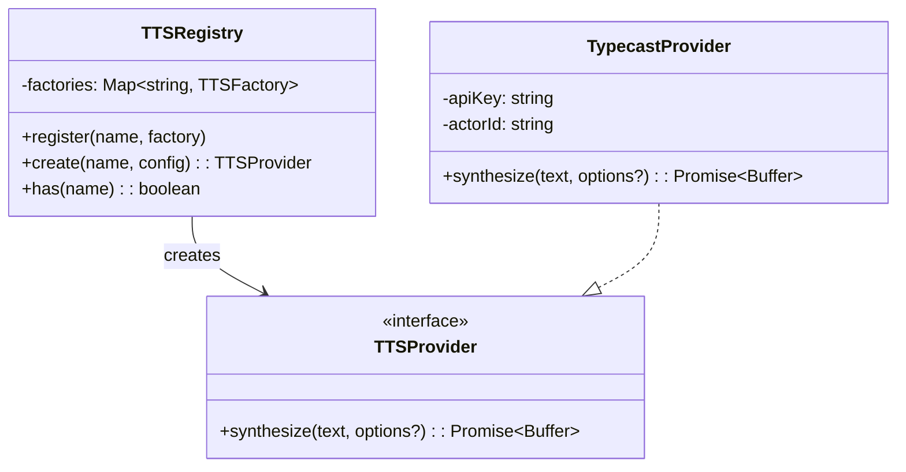
```mermaid
classDiagram
    class TTSRegistry {
        -factories: Map~string, TTSFactory~
        +register(name, factory)
        +create(name, config): TTSProvider
        +has(name): boolean
    }

    class TTSProvider {
        <<interface>>
        +synthesize(text, options?): Promise~Buffer~
    }

    class TypecastProvider {
        -apiKey: string
        -actorId: string
        +synthesize(text, options?): Promise~Buffer~
    }

    TTSRegistry --> TTSProvider : creates
    TypecastProvider ..|> TTSProvider
```

`createTTSRegistry()` returns a registry pre-loaded with the `'typecast'` factory. Additional providers can be registered at runtime.

---

### Tool Logic Layer

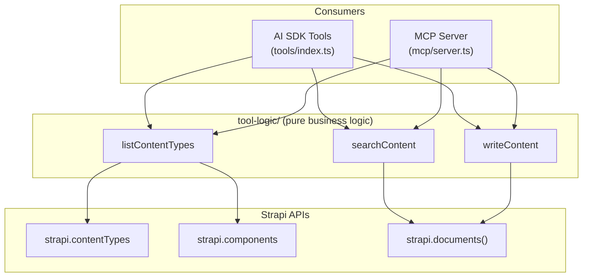
```mermaid
graph TB
    subgraph Consumers
        AITool["AI SDK Tools<br/>(tools/index.ts)"]
        MCPTool["MCP Server<br/>(mcp/server.ts)"]
    end

    subgraph ToolLogic["tool-logic/ (pure business logic)"]
        LCT["listContentTypes"]
        SC["searchContent"]
        WC["writeContent"]
    end

    subgraph Strapi["Strapi APIs"]
        CT["strapi.contentTypes"]
        Comp["strapi.components"]
        Docs["strapi.documents()"]
    end

    AITool --> LCT
    AITool --> SC
    AITool --> WC
    MCPTool --> LCT
    MCPTool --> SC
    MCPTool --> WC
    LCT --> CT
    LCT --> Comp
    SC --> Docs
    WC --> Docs
```

The `tool-logic/` directory contains pure Strapi-coupled business logic with **no HTTP concerns**. Each module exports:
- A **Zod schema** for input validation
- A **description** string
- An **async function** that takes `(strapi, params?)` and returns results

This layer is shared between AI SDK tools and MCP tools, ensuring consistent behavior.

---

### Services

The service layer (`services/service.ts`) is the facade between controllers and `AIProvider`:

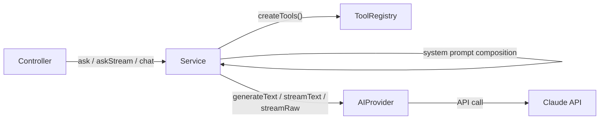
```mermaid
graph LR
    Controller -->|"ask / askStream / chat"| Service
    Service -->|"system prompt composition"| Service
    Service -->|"createTools()"| ToolRegistry
    Service -->|"generateText / streamText / streamRaw"| AIProvider
    AIProvider -->|"API call"| Claude["Claude API"]
```

**System prompt composition** is handled entirely by the service:

```typescript
function composeSystemPrompt(config, toolsDescription, override?) {
  const base = override || config?.systemPrompt || DEFAULT_PREAMBLE;

  // Support {tools} placeholder
  if (base.includes('{tools}')) {
    return base.replace('{tools}', toolsDescription);
  }

  // Otherwise append tool descriptions
  return `${base}\n\n${toolsDescription}`;
}
```

The default preamble is:
> "You are a Strapi CMS assistant. Use your tools to fulfill user requests. When asked to create or update content, use the appropriate tool -- do not tell the user you cannot."

---

### Controllers & Routes

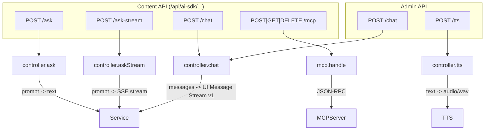
```mermaid
graph TB
    subgraph ContentAPI["Content API (/api/ai-sdk/...)"]
        R1["POST /ask"]
        R2["POST /ask-stream"]
        R3["POST /chat"]
        R4["POST|GET|DELETE /mcp"]
    end

    subgraph AdminAPI["Admin API"]
        R5["POST /chat"]
        R6["POST /tts"]
    end

    R1 --> C1["controller.ask"]
    R2 --> C2["controller.askStream"]
    R3 --> C3["controller.chat"]
    R4 --> C4["mcp.handle"]
    R5 --> C3
    R6 --> C5["controller.tts"]

    C1 -->|"prompt -> text"| Service
    C2 -->|"prompt -> SSE stream"| Service
    C3 -->|"messages -> UI Message Stream v1"| Service
    C4 -->|"JSON-RPC"| MCPServer
    C5 -->|"text -> audio/wav"| TTS
```

| Endpoint | Type | Handler | Description |
|----------|------|---------|-------------|
| `POST /ask` | Content API | `controller.ask` | Simple prompt -> text response |
| `POST /ask-stream` | Content API | `controller.askStream` | Prompt -> SSE text stream |
| `POST /chat` | Content API + Admin | `controller.chat` | Messages -> UI Message Stream v1 |
| `POST/GET/DELETE /mcp` | Content API | `mcp.handle` | MCP JSON-RPC over HTTP |
| `POST /tts` | Admin only | `controller.tts` | Text -> audio/wav buffer |

---

### MCP Server

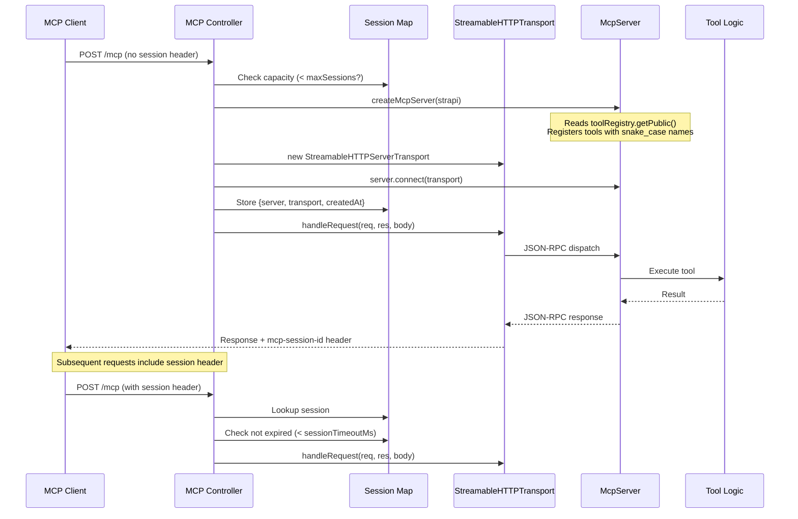
```mermaid
sequenceDiagram
    participant Client as MCP Client
    participant Controller as MCP Controller
    participant Sessions as Session Map
    participant Transport as StreamableHTTPTransport
    participant Server as McpServer
    participant Tools as Tool Logic

    Client->>Controller: POST /mcp (no session header)
    Controller->>Sessions: Check capacity (< maxSessions?)
    Controller->>Server: createMcpServer(strapi)
    Note over Server: Reads toolRegistry.getPublic()<br/>Registers tools with snake_case names
    Controller->>Transport: new StreamableHTTPServerTransport
    Controller->>Server: server.connect(transport)
    Controller->>Sessions: Store {server, transport, createdAt}
    Controller->>Transport: handleRequest(req, res, body)
    Transport->>Server: JSON-RPC dispatch
    Server->>Tools: Execute tool
    Tools-->>Server: Result
    Server-->>Transport: JSON-RPC response
    Transport-->>Client: Response + mcp-session-id header

    Note over Client,Controller: Subsequent requests include session header

    Client->>Controller: POST /mcp (with session header)
    Controller->>Sessions: Lookup session
    Controller->>Sessions: Check not expired (< sessionTimeoutMs)
    Controller->>Transport: handleRequest(req, res, body)
```

**Session management details:**
- Sessions expire after `sessionTimeoutMs` (default: 4 hours) of inactivity
- Maximum `maxSessions` (default: 100) concurrent sessions
- Expired sessions are cleaned up every `cleanupInterval` (default: 100) requests
- When at capacity, cleanup runs first; if still full, returns HTTP 429
- All config is read once at controller creation time (inside the factory closure)

---

## Admin-Side Architecture

### Component Tree

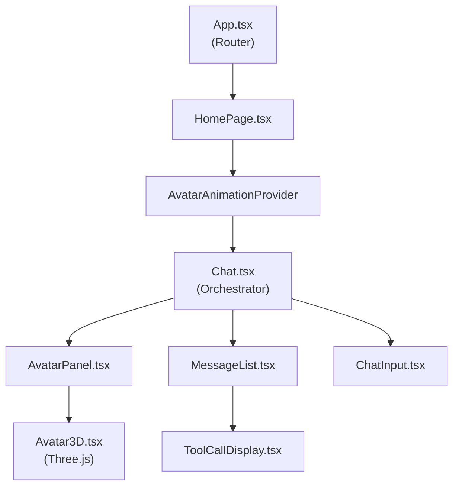
```mermaid
graph TB
    App["App.tsx<br/>(Router)"]
    HomePage["HomePage.tsx"]
    Provider["AvatarAnimationProvider"]
    Chat["Chat.tsx<br/>(Orchestrator)"]
    AvatarPanel["AvatarPanel.tsx"]
    Avatar3D["Avatar3D.tsx<br/>(Three.js)"]
    MessageList["MessageList.tsx"]
    ChatInput["ChatInput.tsx"]
    ToolCallDisplay["ToolCallDisplay.tsx"]

    App --> HomePage
    HomePage --> Provider
    Provider --> Chat
    Chat --> AvatarPanel
    Chat --> MessageList
    Chat --> ChatInput
    AvatarPanel --> Avatar3D
    MessageList --> ToolCallDisplay
```

### Chat Component Split

The Chat UI is split into focused components, each with co-located styled-components:

| Component | Responsibility | Lines |
|-----------|---------------|-------|
| `Chat.tsx` | Orchestrator -- wires hooks to subcomponents | ~100 |
| `MessageList.tsx` | Message rendering loop, typing indicator, markdown | ~130 |
| `ChatInput.tsx` | Input field, voice toggle, send button | ~90 |
| `ToolCallDisplay.tsx` | Collapsible tool call viewer | ~70 |

**Chat.tsx** manages all state and passes props down:

```typescript
export function Chat() {
  // State
  const [input, setInput] = useState('');
  const [voiceEnabled, setVoiceEnabled] = useState(false);
  const [awaitingAudio, setAwaitingAudio] = useState(false);

  // Hooks
  const { trigger, clearAnimation } = useAvatarAnimation();
  const { visibleText, startReveal, reset: resetReveal } = useTextReveal();
  const { speak, stop: stopAudio } = useAudioPlayer({ onPlayStart, onPlayEnded });
  const { messages, sendMessage, isLoading, error } = useChat({ onAnimationTrigger, onStreamEnd });

  return (
    <ChatLayout>
      <AvatarPanel />
      <ChatWrapper>
        <MessageList
          ref={messagesEndRef}
          messages={messages}
          isLoading={isLoading}
          awaitingAudio={awaitingAudio}
          voiceEnabled={voiceEnabled}
          visibleText={visibleText}
        />
        {error && <ErrorBox />}
        <ChatInput
          input={input}
          isLoading={isLoading}
          voiceEnabled={voiceEnabled}
          onInputChange={setInput}
          onSend={handleSend}
          onToggleVoice={handleToggleVoice}
        />
      </ChatWrapper>
    </ChatLayout>
  );
}
```

---

### Hooks

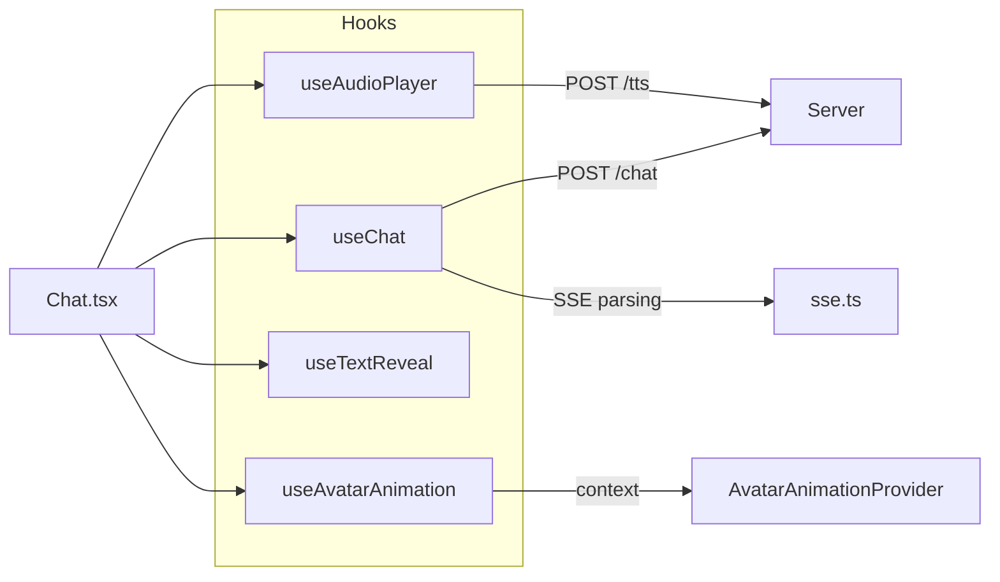
```mermaid
graph LR
    subgraph Hooks
        UC["useChat"]
        UAP["useAudioPlayer"]
        UTR["useTextReveal"]
        UAA["useAvatarAnimation"]
    end

    Chat["Chat.tsx"] --> UC
    Chat --> UAP
    Chat --> UTR
    Chat --> UAA

    UC -->|"POST /chat"| Server
    UC -->|"SSE parsing"| SSEUtils["sse.ts"]
    UAP -->|"POST /tts"| Server
    UAA -->|"context"| AvatarProvider["AvatarAnimationProvider"]
```

| Hook | Purpose | Key Returns |
|------|---------|-------------|
| `useChat` | Message state, SSE streaming, tool call tracking | `messages`, `sendMessage`, `isLoading`, `error` |
| `useAudioPlayer` | TTS fetch, Audio playback | `speak(text)`, `stop()`, `isPlaying` |
| `useTextReveal` | Progressive text reveal synced to audio duration | `visibleText`, `startReveal(text, duration)`, `reset()` |
| `useAvatarAnimation` | Context consumer for animation triggers | `trigger(name)`, `clearAnimation()` |

**SSE Protocol (UI Message Stream v1):**

The `sse.ts` utility parses the AI SDK streaming format:

| Event Type | Data | Usage |
|------------|------|-------|
| `text-delta` | `{ delta: string }` | Accumulated into message content |
| `tool-input-available` | `{ toolCallId, toolName, input }` | Added to message's toolCalls array |
| `tool-output-available` | `{ toolCallId, output }` | Updates toolCalls output field |

---

### Avatar 3D System

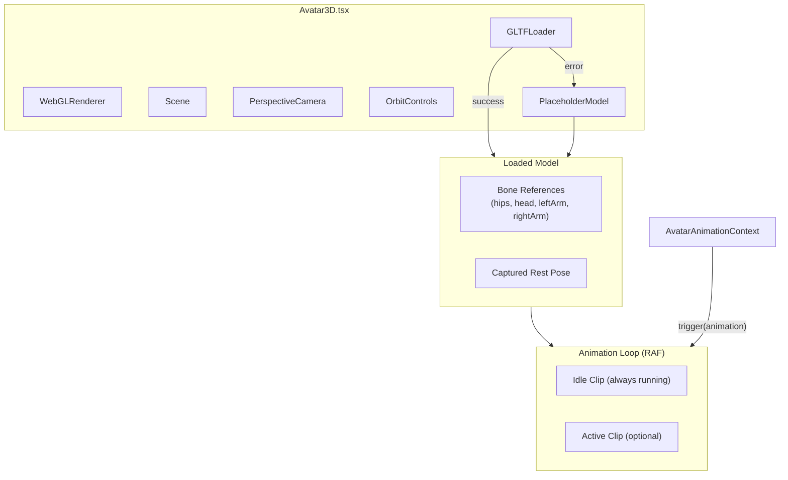
```mermaid
graph TB
    subgraph Avatar3D["Avatar3D.tsx"]
        Renderer["WebGLRenderer"]
        Scene["Scene"]
        Camera["PerspectiveCamera"]
        Controls["OrbitControls"]
        GLBLoader["GLTFLoader"]
        Fallback["PlaceholderModel"]
    end

    subgraph Model["Loaded Model"]
        Bones["Bone References<br/>(hips, head, leftArm, rightArm)"]
        RestPose["Captured Rest Pose"]
    end

    subgraph AnimLoop["Animation Loop (RAF)"]
        IdleClip["Idle Clip (always running)"]
        ActiveClip["Active Clip (optional)"]
    end

    GLBLoader -->|"success"| Model
    GLBLoader -->|"error"| Fallback
    Fallback --> Model
    Model --> AnimLoop
    AvatarContext["AvatarAnimationContext"] -->|"trigger(animation)"| AnimLoop
```

**Custom Avatar Model (optional):**

The plugin includes a built-in procedural avatar that works out of the box. To use a custom `.glb` model instead:

1. Place your `.glb` file at `<strapi-project>/public/models/avatar.glb`
2. Restart Strapi

The plugin will automatically detect and load it. If the file is missing, you'll see a console message and the built-in avatar is used. To always use the built-in avatar, set `MODEL_PATH = null` in `Avatar3D.tsx`.

**Why raw Three.js instead of React Three Fiber?**

R3F's custom React reconciler is incompatible with Strapi's React 18 runtime (even R3F v8). It causes `Cannot read properties of undefined (reading 'S')` at runtime. The plugin uses imperative Three.js with `useRef`/`useEffect` instead.

---

### Animation System

All animations are **procedural** (no keyframe files) and **additive** (layered on top of the rest pose):

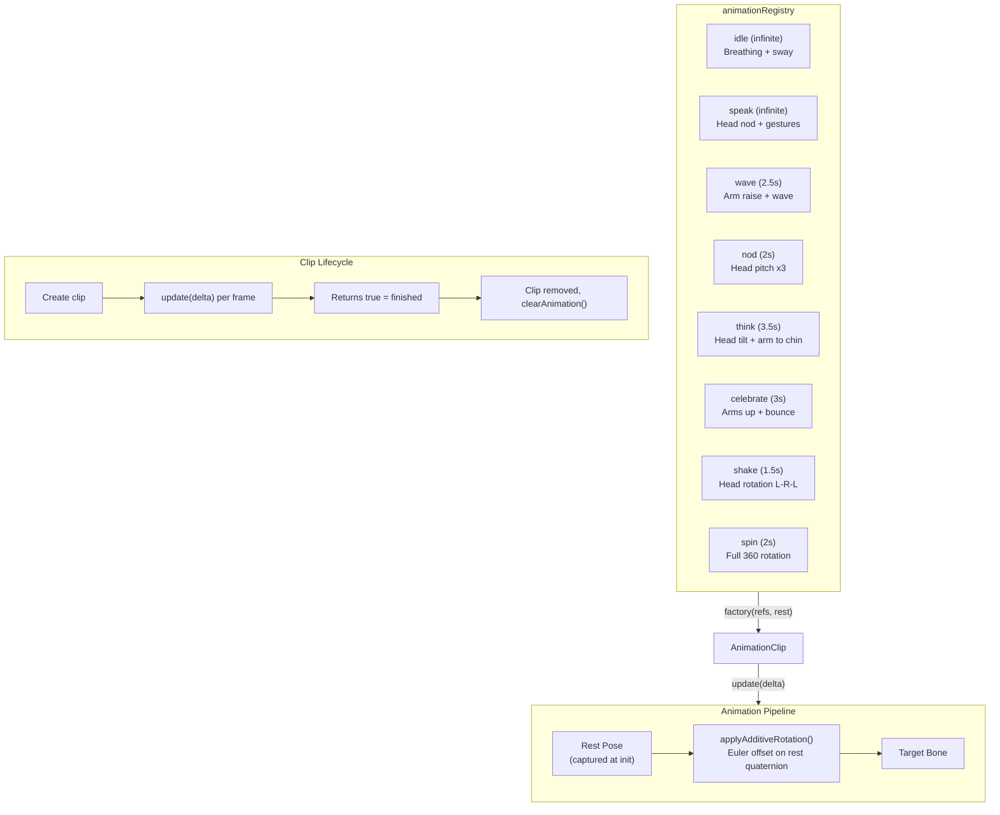
```mermaid
graph TB
    subgraph Registry["animationRegistry"]
        idle["idle (infinite)<br/>Breathing + sway"]
        speak["speak (infinite)<br/>Head nod + gestures"]
        wave["wave (2.5s)<br/>Arm raise + wave"]
        nod["nod (2s)<br/>Head pitch x3"]
        think["think (3.5s)<br/>Head tilt + arm to chin"]
        celebrate["celebrate (3s)<br/>Arms up + bounce"]
        shake["shake (1.5s)<br/>Head rotation L-R-L"]
        spin["spin (2s)<br/>Full 360 rotation"]
    end

    subgraph Pipeline["Animation Pipeline"]
        RestPose["Rest Pose<br/>(captured at init)"]
        Additive["applyAdditiveRotation()<br/>Euler offset on rest quaternion"]
        Bone["Target Bone"]
    end

    Registry -->|"factory(refs, rest)"| Clip["AnimationClip"]
    Clip -->|"update(delta)"| Pipeline
    RestPose --> Additive
    Additive --> Bone

    subgraph Lifecycle["Clip Lifecycle"]
        Create["Create clip"]
        Update["update(delta) per frame"]
        Done["Returns true = finished"]
        Remove["Clip removed, clearAnimation()"]
    end

    Create --> Update --> Done --> Remove
```

The **idle** animation runs perpetually as the background layer. When a named animation is triggered, it creates an **active clip** that runs on top of idle. When the active clip's `update()` returns `true`, it's removed and `clearAnimation()` resets to idle.

---

## Data Flows

### Chat Request Flow

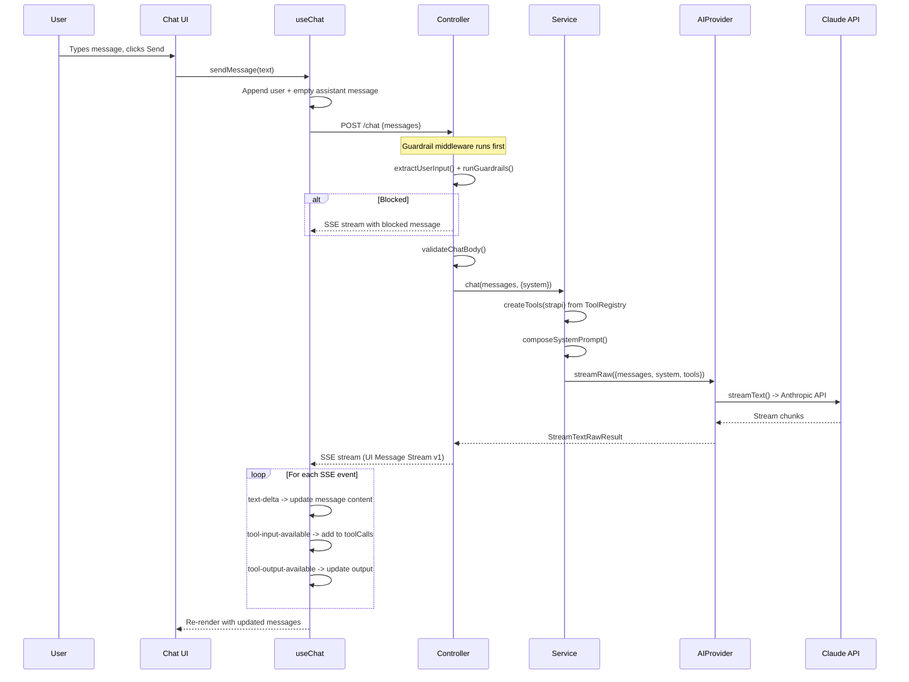
```mermaid
sequenceDiagram
    participant User
    participant ChatUI as Chat UI
    participant useChat
    participant Controller
    participant Service
    participant AIProvider
    participant Claude as Claude API

    User->>ChatUI: Types message, clicks Send
    ChatUI->>useChat: sendMessage(text)
    useChat->>useChat: Append user + empty assistant message
    useChat->>Controller: POST /chat {messages}

    Note over Controller: Guardrail middleware runs first
    Controller->>Controller: extractUserInput() + runGuardrails()
    alt Blocked
        Controller-->>useChat: SSE stream with blocked message
    end

    Controller->>Controller: validateChatBody()
    Controller->>Service: chat(messages, {system})
    Service->>Service: createTools(strapi) from ToolRegistry
    Service->>Service: composeSystemPrompt()
    Service->>AIProvider: streamRaw({messages, system, tools})
    AIProvider->>Claude: streamText() -> Anthropic API
    Claude-->>AIProvider: Stream chunks
    AIProvider-->>Controller: StreamTextRawResult
    Controller-->>useChat: SSE stream (UI Message Stream v1)

    loop For each SSE event
        useChat->>useChat: text-delta -> update message content
        useChat->>useChat: tool-input-available -> add to toolCalls
        useChat->>useChat: tool-output-available -> update output
    end

    useChat-->>ChatUI: Re-render with updated messages
```

### MCP Request Flow

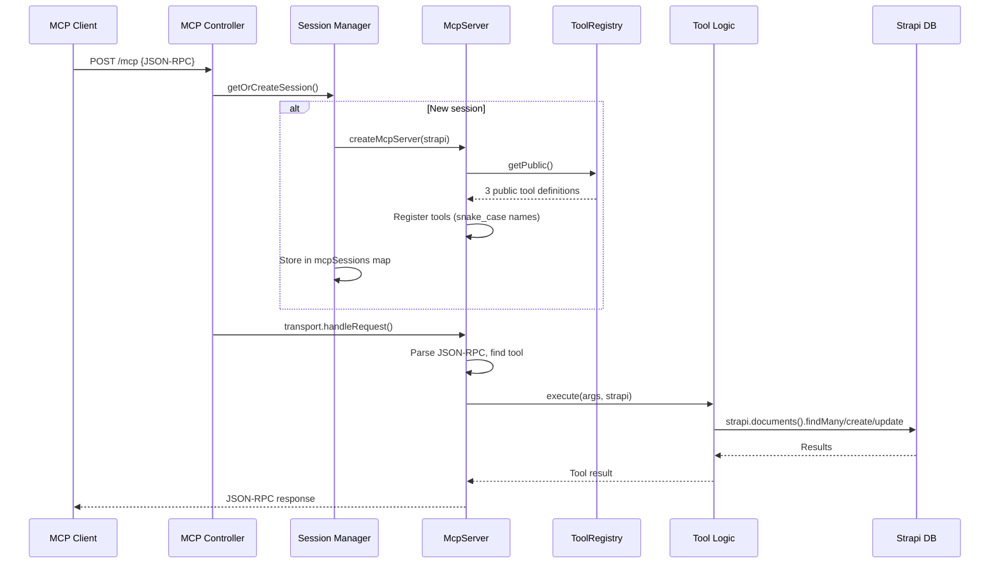
```mermaid
sequenceDiagram
    participant Client as MCP Client
    participant MCP as MCP Controller
    participant Session as Session Manager
    participant Server as McpServer
    participant Registry as ToolRegistry
    participant Logic as Tool Logic
    participant DB as Strapi DB

    Client->>MCP: POST /mcp {JSON-RPC}
    MCP->>Session: getOrCreateSession()

    alt New session
        Session->>Server: createMcpServer(strapi)
        Server->>Registry: getPublic()
        Registry-->>Server: 3 public tool definitions
        Server->>Server: Register tools (snake_case names)
        Session->>Session: Store in mcpSessions map
    end

    MCP->>Server: transport.handleRequest()
    Server->>Server: Parse JSON-RPC, find tool
    Server->>Logic: execute(args, strapi)
    Logic->>DB: strapi.documents().findMany/create/update
    DB-->>Logic: Results
    Logic-->>Server: Tool result
    Server-->>Client: JSON-RPC response
```

### Voice Mode Flow

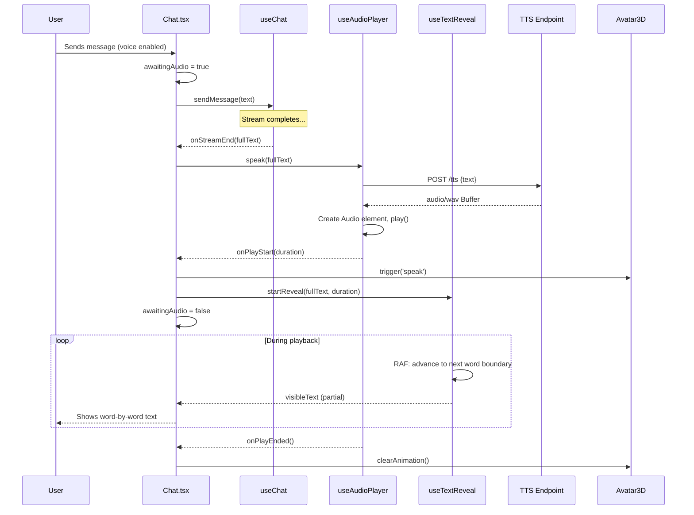
```mermaid
sequenceDiagram
    participant User
    participant Chat as Chat.tsx
    participant useChat
    participant useAudio as useAudioPlayer
    participant useReveal as useTextReveal
    participant TTS as TTS Endpoint
    participant Avatar as Avatar3D

    User->>Chat: Sends message (voice enabled)
    Chat->>Chat: awaitingAudio = true
    Chat->>useChat: sendMessage(text)

    Note over useChat: Stream completes...
    useChat-->>Chat: onStreamEnd(fullText)
    Chat->>useAudio: speak(fullText)
    useAudio->>TTS: POST /tts {text}
    TTS-->>useAudio: audio/wav Buffer
    useAudio->>useAudio: Create Audio element, play()

    useAudio-->>Chat: onPlayStart(duration)
    Chat->>Avatar: trigger('speak')
    Chat->>useReveal: startReveal(fullText, duration)
    Chat->>Chat: awaitingAudio = false

    loop During playback
        useReveal->>useReveal: RAF: advance to next word boundary
        useReveal-->>Chat: visibleText (partial)
        Chat-->>User: Shows word-by-word text
    end

    useAudio-->>Chat: onPlayEnded()
    Chat->>Avatar: clearAnimation()
```

### Animation Flow

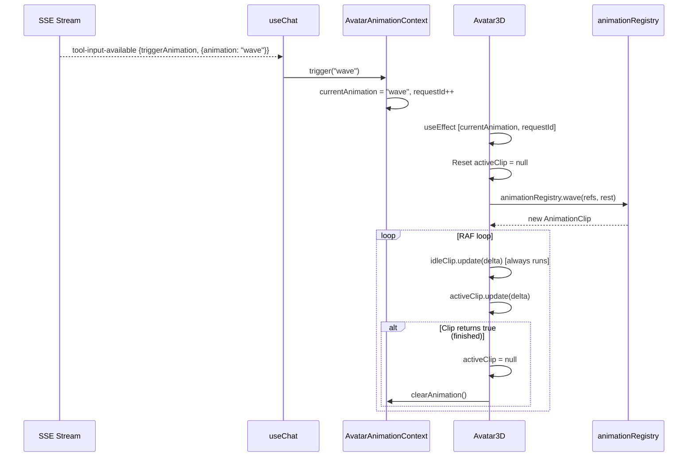
```mermaid
sequenceDiagram
    participant Stream as SSE Stream
    participant useChat
    participant Context as AvatarAnimationContext
    participant Avatar3D
    participant AnimReg as animationRegistry

    Stream-->>useChat: tool-input-available {triggerAnimation, {animation: "wave"}}
    useChat->>Context: trigger("wave")
    Context->>Context: currentAnimation = "wave", requestId++

    Avatar3D->>Avatar3D: useEffect [currentAnimation, requestId]
    Avatar3D->>Avatar3D: Reset activeClip = null
    Avatar3D->>AnimReg: animationRegistry.wave(refs, rest)
    AnimReg-->>Avatar3D: new AnimationClip

    loop RAF loop
        Avatar3D->>Avatar3D: idleClip.update(delta) [always runs]
        Avatar3D->>Avatar3D: activeClip.update(delta)
        alt Clip returns true (finished)
            Avatar3D->>Avatar3D: activeClip = null
            Avatar3D->>Context: clearAnimation()
        end
    end
```

---

## Extending the Plugin

### Adding a Custom Tool

**Option A: Add a built-in tool** (inside the plugin)

Create a new file in `tools/definitions/` and add it to the barrel:

```typescript
// tools/definitions/analyze-content.ts
import { z } from 'zod';
import type { ToolDefinition } from '../../lib/tool-registry';

export const analyzeContentTool: ToolDefinition = {
  name: 'analyzeContent',
  description: 'Analyze content quality and suggest improvements',
  schema: z.object({
    contentType: z.string().describe('Content type UID'),
    documentId: z.string().describe('Document ID to analyze'),
  }),
  execute: async (args, strapi) => {
    const doc = await strapi.documents(args.contentType).findOne({
      documentId: args.documentId,
    });
    // Your analysis logic here...
    return { score: 85, suggestions: ['Add more headings', 'Improve readability'] };
  },
  internal: false, // Set to true to hide from MCP
};
```

Then add it to the barrel in `tools/definitions/index.ts`:

```typescript
import { analyzeContentTool } from './analyze-content';

export const builtInTools: ToolDefinition[] = [
  // ...existing tools
  analyzeContentTool,
];
```

**Option B: Register at runtime** (from your Strapi app or another plugin)

```typescript
// src/index.ts (your Strapi app)
import { z } from 'zod';

export default {
  bootstrap({ strapi }) {
    const plugin = strapi.plugin('ai-sdk');
    plugin.toolRegistry.register({
      name: 'analyzeContent',
      description: 'Analyze content quality and suggest improvements',
      schema: z.object({
        contentType: z.string().describe('Content type UID'),
        documentId: z.string().describe('Document ID to analyze'),
      }),
      execute: async (args, strapi) => {
        const doc = await strapi.documents(args.contentType).findOne({
          documentId: args.documentId,
        });
        return { score: 85, suggestions: ['Add more headings'] };
      },
    });
  },
};
```

Either way, the tool is automatically available in:
- **AI Chat** (via `createTools()` which reads `getAll()`)
- **MCP** (via `createMcpServer()` which reads `getPublic()`, unless `internal: true`)

No changes to `tools/index.ts` or `mcp/server.ts` needed.

### Adding an AI Provider

```typescript
// src/index.ts
import { createOpenAI } from '@ai-sdk/openai';
import { AIProvider } from 'ai-sdk/server';

export default {
  register({ strapi }) {
    // Register BEFORE bootstrap runs
    AIProvider.registerProvider('openai', ({ apiKey, baseURL }) => {
      const provider = createOpenAI({ apiKey, baseURL });
      return (modelId: string) => provider(modelId);
    });
  },
};
```

Then in `config/plugins.ts`:

```typescript
export default {
  'ai-sdk': {
    config: {
      anthropicApiKey: env('OPENAI_API_KEY'), // reuses same config field
      provider: 'openai',
      chatModel: 'gpt-4o',
    },
  },
};
```

### Adding a TTS Provider

```typescript
// src/index.ts
export default {
  bootstrap({ strapi }) {
    const plugin = strapi.plugin('ai-sdk');

    plugin.ttsRegistry.register('elevenlabs', (config) => ({
      async synthesize(text, options) {
        // Call ElevenLabs API...
        return audioBuffer;
      },
    }));

    // Optionally set as the active provider
    plugin.ttsProvider = plugin.ttsRegistry.create('elevenlabs', {
      apiKey: process.env.ELEVENLABS_API_KEY,
      voiceId: 'some-voice-id',
    });
  },
};
```

### Customizing the System Prompt

**Option A: Simple replacement**

```typescript
// config/plugins.ts
export default {
  'ai-sdk': {
    config: {
      systemPrompt: 'You are a friendly content editor for our blog platform.',
      // Tool descriptions will be appended automatically
    },
  },
};
```

**Option B: Using the `{tools}` placeholder**

```typescript
export default {
  'ai-sdk': {
    config: {
      systemPrompt: `You are a blog content assistant.

IMPORTANT RULES:
- Always use friendly, casual language
- Never create content without asking for confirmation first

{tools}

When listing content types, summarize them in a table format.`,
    },
  },
};
```

**Option C: Per-request override** (via API)

```bash
curl -X POST http://localhost:1337/api/ai-sdk/chat \
  -H "Content-Type: application/json" \
  -d '{
    "messages": [...],
    "system": "You are a technical documentation writer."
  }'
```

Per-request `system` takes priority over config `systemPrompt`.

### Tuning MCP Session Limits

```typescript
// config/plugins.ts
export default {
  'ai-sdk': {
    config: {
      mcp: {
        sessionTimeoutMs: 30 * 60 * 1000,  // 30 minutes
        maxSessions: 20,                     // Lower for constrained environments
        cleanupInterval: 50,                 // More frequent cleanup
      },
    },
  },
};
```

---

## Testing

### Test Scripts

The plugin uses **end-to-end integration tests** that run against a live Strapi instance. No test framework is needed -- each test is a standalone script using native `fetch`.

| Script | Command | What It Tests |
|---|---|---|
| `test:api` | `npx tsx tests/ai-sdk.test.ts` | `/ask` and `/ask-stream` endpoints (valid requests, error handling) |
| `test:stream` | `node tests/test-stream.mjs` | Streaming response (visual output, chunk timing) |
| `test:chat` | `node tests/test-chat.mjs` | Chat endpoint with UI Message Stream v1 protocol |
| `test:guardrails` | `npx tsx tests/test-guardrails.ts` | All guardrail categories (42 assertions) |
| `test:ts:front` | `tsc -p admin/tsconfig.json` | Admin TypeScript type checking |
| `test:ts:back` | `tsc -p server/tsconfig.json` | Server TypeScript type checking |

### Testing Methodology

**Why e2e scripts instead of unit tests?**

The plugin's value is in how its components work together end-to-end: middleware intercepts requests, the AI provider streams responses, tools execute against the Strapi document API, and SSE events reach the frontend. Unit tests with mocked Strapi internals would miss integration issues while adding maintenance burden. Standalone scripts with `fetch` are simple, framework-free, and test the actual request pipeline.

**Test design principles:**

- **Self-contained** -- each script runs independently, no shared state
- **Health check first** -- all scripts verify Strapi is running before testing
- **Pass/fail output** -- clear emoji indicators, exit code 1 on failure
- **Auth-aware** -- `STRAPI_TOKEN` env var for authenticated endpoints
- **Smart assertions** -- guardrail tests check response body (not just status code) to distinguish guardrail blocks from permission blocks

### Running Tests

**Prerequisites:**

1. Strapi is running (`yarn dev` in the Strapi app)
2. Plugin is built (`npm run build` in the plugin directory)
3. Content API endpoints are accessible (either public or via API token)

**Run all tests:**

```bash
# From the plugin directory
npm run test:guardrails    # Guardrail safety tests
npm run test:api           # API endpoint tests
npm run test:stream        # Streaming visual test
npm run test:chat          # Chat protocol test
```

**With authentication:**

```bash
STRAPI_TOKEN=your-api-token npm run test:guardrails
```

**Type checking only (no running Strapi needed):**

```bash
npm run test:ts:back
npm run test:ts:front
```

---

## File Reference

```
server/src/
  index.ts                          # Server entry point (assembles all modules)
  register.ts                       # No-op register lifecycle
  bootstrap.ts                      # Initialize all registries and providers
  destroy.ts                        # Graceful shutdown
  config/
    index.ts                        # Plugin config defaults and validator
  guardrails/
    default-patterns.json           # Built-in regex patterns (5 categories)
    types.ts                        # GuardrailInput, GuardrailResult, GuardrailConfig
    index.ts                        # Core logic (normalize, extract, match, run)
    middleware.ts                    # Strapi route middleware factory
  middlewares/
    index.ts                        # Registers { guardrail } middleware
  lib/
    types.ts                        # Shared types (PluginConfig, PluginInstance, etc.)
    ai-provider.ts                  # AIProvider class with static provider registry
    tool-registry.ts                # ToolRegistry class
    utils.ts                        # Controller helpers (validation, SSE)
    tts/
      index.ts                      # TTSRegistry class + createTTSRegistry()
      types.ts                      # TTSProvider interface
      typecast-provider.ts          # Typecast API implementation
  controllers/
    controller.ts                   # ask, askStream, chat, tts handlers
    mcp.ts                          # MCP session management + transport
  services/
    service.ts                      # AI service facade (prompt composition, tool wiring)
  routes/
    content-api/index.ts            # Public API routes (/ask, /chat, /mcp) + guardrail middleware
    admin/index.ts                  # Admin routes (/chat, /tts) + guardrail middleware
  tools/
    index.ts                        # createTools() + describeTools() bridge to registry
    definitions/
      index.ts                      # Barrel: exports builtInTools array
      list-content-types.ts         # listContentTypes tool definition
      search-content.ts             # searchContent tool definition
      write-content.ts              # writeContent tool definition
      trigger-animation.ts          # triggerAnimation tool definition (internal)
  tool-logic/
    index.ts                        # Re-exports all tool logic
    list-content-types.ts           # List content types logic + schema
    search-content.ts               # Search content logic + schema
    write-content.ts                # Write content logic + schema
  mcp/
    server.ts                       # createMcpServer() from registry
    utils/
      sanitize.ts                   # Input/output sanitization for Strapi content API

admin/src/
  index.ts                          # Admin entry point (menu, routes)
  pluginId.ts                       # PLUGIN_ID constant
  pages/
    App.tsx                         # Router
    HomePage.tsx                    # Main page layout
  components/
    Chat.tsx                        # Chat orchestrator
    MessageList.tsx                 # Message rendering
    ChatInput.tsx                   # Input field + voice toggle
    ToolCallDisplay.tsx             # Collapsible tool call viewer
    AvatarPanel.tsx                 # Left panel with 3D avatar
    Avatar3D/
      Avatar3D.tsx                  # Three.js renderer + animation driver
      animations.ts                 # Procedural animation registry
      PlaceholderModel.ts           # Fallback chibi character model
    Initializer.tsx                 # Plugin readiness signal
    PluginIcon.tsx                  # Menu icon
  hooks/
    useChat.ts                      # Chat state + SSE streaming
    useAudioPlayer.ts               # TTS audio playback
    useTextReveal.ts                # Progressive text reveal
  context/
    AvatarAnimationContext.tsx       # Animation state context
  utils/
    auth.ts                         # JWT token + backend URL helpers
    sse.ts                          # SSE parser for UI Message Stream v1
    getTranslation.ts               # i18n key helper
  translations/
    en.json                         # English translations (empty)

tests/
  ai-sdk.test.ts                    # /ask and /ask-stream endpoint tests
  test-stream.mjs                   # Streaming visual test (chunk timing)
  test-chat.mjs                     # Chat endpoint with conversation history
  test-guardrails.ts                # Guardrail e2e tests (42 assertions)

docs/
  architecture.md                   # This file
  guardrails.md                     # Guardrails comprehensive guide
```
