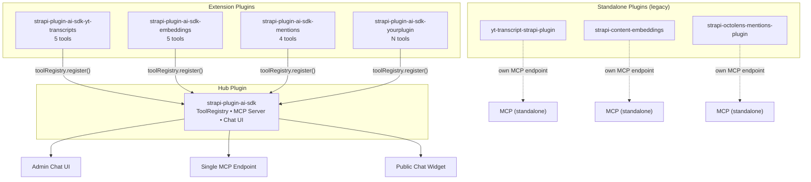

# Tool Standardization Spec

> The definitive standard for building tools in the Strapi AI plugin ecosystem.
> `strapi-plugin-ai-sdk` is the hub. Extension plugins register tools with it.

---

## Table of Contents

1. [Architecture: Hub & Extensions](#1-architecture-hub--extensions)
2. [Two Plugin Tracks](#2-two-plugin-tracks)
3. [Naming Convention](#3-naming-convention)
4. [The Tool Standard: Zod-First](#4-the-tool-standard-zod-first)
5. [How to Build an Extension Plugin](#5-how-to-build-an-extension-plugin)
6. [Tool Namespacing in the Registry](#6-tool-namespacing-in-the-registry)
7. [How the AI SDK Discovers Tools](#7-how-the-ai-sdk-discovers-tools)
8. [Cross-Framework Portability](#8-cross-framework-portability)
9. [Migration Guide: Converting Standalone Plugins](#9-migration-guide-converting-standalone-plugins)
10. [FAQ](#10-faq)
11. [Appendix: Why Zod-First Over MCP-Native](#appendix-why-zod-first-over-mcp-native)

---

## 1. Architecture: Hub & Extensions



**`strapi-plugin-ai-sdk`** is the central hub. It provides:
- The `ToolRegistry` where all tools are registered
- A single MCP endpoint that exposes all registered tools
- The admin chat UI that can invoke any tool
- The public chat widget with `publicSafe` tool filtering

**Extension plugins** are lightweight packages that register tools with the hub. They:
- Declare `strapi-plugin-ai-sdk` as a peer dependency
- Register tools in their `bootstrap()` function
- Do NOT run their own MCP server
- Do NOT need their own chat UI

---

## 2. Two Plugin Tracks

| Aspect | Standalone plugins (legacy) | Extension plugins (going forward) |
|---|---|---|
| **Examples** | `yt-transcript-strapi-plugin`, `strapi-content-embeddings`, `strapi-octolens-mentions-plugin` | `strapi-plugin-ai-sdk-yt-transcripts`, `strapi-plugin-ai-sdk-embeddings` |
| **MCP server** | Each runs its own | None — ai-sdk exposes all tools via one endpoint |
| **Requires ai-sdk** | No | Yes (peer dependency) |
| **Boilerplate** | MCP server, transport, sessions, auth | Just `toolRegistry.register()` in bootstrap |
| **Chat UI** | None (or manual integration) | Automatic via ai-sdk |
| **Status** | Maintained for existing users, no breaking changes | The standard for all new tool plugins |

**Decision:** Existing standalone plugins are kept as-is. New tool plugins are built as ai-sdk extensions. When a standalone plugin reaches a natural major version, it may be migrated to the extension model.

---

## 3. Naming Convention

### Package names

Extension plugins use the `strapi-plugin-ai-sdk-*` namespace:

```
strapi-plugin-ai-sdk                    ← hub (already exists)
strapi-plugin-ai-sdk-yt-transcripts        ← YouTube transcript tools
strapi-plugin-ai-sdk-embeddings         ← vector embedding tools
strapi-plugin-ai-sdk-mentions           ← social mention tools
strapi-plugin-ai-sdk-analytics          ← analytics tools
strapi-plugin-ai-sdk-<yourplugin>       ← your extension
```

This makes it clear they belong to the ai-sdk family and require the hub.

### Strapi plugin ID

Strapi derives the plugin ID from the package name. For `strapi-plugin-ai-sdk-yt-transcripts`:

```json
{
  "strapi": {
    "kind": "plugin",
    "name": "ai-sdk-yt-transcripts",
    "displayName": "AI SDK: Transcripts"
  }
}
```

The plugin ID becomes `ai-sdk-yt-transcripts`. Access it at runtime:

```typescript
strapi.plugin('ai-sdk-yt-transcripts')
```

### Tool names

Tools use **camelCase** internally and in the AI SDK registry:

```
fetchTranscript
listTranscripts
searchTranscript
```

The MCP server auto-converts to **snake_case** on the wire:

```
fetch_transcript
list_transcripts
search_transcript
```

### Tool namespacing in the registry

When an extension registers tools, ai-sdk prefixes them with the plugin ID to prevent collisions:

```
ai-sdk-yt-transcripts:fetchTranscript
ai-sdk-yt-transcripts:listTranscripts
ai-sdk-embeddings:semanticSearch
```

Built-in ai-sdk tools have no prefix:

```
listContentTypes
searchContent
createContent
updateContent
```

On the MCP wire, namespaced names become:

```
ai_sdk_transcripts__fetch_transcript
ai_sdk_transcripts__list_transcripts
ai_sdk_embeddings__semantic_search
```

---

## 4. The Tool Standard: Zod-First

All tools — built-in and extension — follow the same `ToolDefinition` interface.

### The interface

```typescript
import type { Core } from '@strapi/strapi';
import type { z } from 'zod';

export interface ToolContext {
  adminUserId?: number;
}

export interface ToolDefinition {
  /** Unique tool name in camelCase (e.g., "fetchTranscript") */
  name: string;

  /** Human-readable description for the AI model.
   *  Be specific about WHEN to use this tool and what it returns. */
  description: string;

  /** Zod schema defining accepted parameters.
   *  Every field must have .describe() for the AI model. */
  schema: z.ZodObject<any>;

  /** Handler that executes the tool logic.
   *  Must return a raw JS object (no MCP envelopes). */
  execute: (
    args: any,
    strapi: Core.Strapi,
    context?: ToolContext
  ) => Promise<unknown>;

  /** If true, only available in AI SDK admin chat. Not exposed via MCP. */
  internal?: boolean;

  /** If true, safe for unauthenticated public chat (read-only). */
  publicSafe?: boolean;
}
```

### Rules

1. **One file per tool.** Schema, description, handler, and definition live together.
2. **Zod schemas are the source of truth.** Use `.describe()` on every field.
3. **Handlers return raw objects.** Never return MCP envelopes. The MCP layer wraps automatically.
4. **Names are camelCase.** MCP snake_case conversion is automatic.
5. **Context is optional.** Only use it if you need `adminUserId`.
6. **Throw on errors.** The registry catches and formats them.

### Example tool file

```typescript
// server/src/tools/fetch-transcript.ts

import type { Core } from '@strapi/strapi';
import { z } from 'zod';

export const fetchTranscriptSchema = z.object({
  videoId: z
    .string()
    .describe('YouTube video ID or URL'),
});

export const fetchTranscriptDescription =
  'Fetch and store a YouTube video transcript. Returns metadata, word count, and a preview of the transcript text.';

export async function fetchTranscript(
  strapi: Core.Strapi,
  params: z.infer<typeof fetchTranscriptSchema>
) {
  // ... core logic
  return { videoId, title, wordCount, preview };
}

export const fetchTranscriptTool: ToolDefinition = {
  name: 'fetchTranscript',
  description: fetchTranscriptDescription,
  schema: fetchTranscriptSchema,
  execute: async (args, strapi) => fetchTranscript(strapi, args),
};
```

---

## 5. How to Build an Extension Plugin

### Minimal structure

```
strapi-plugin-ai-sdk-yt-transcripts/
├── package.json
├── server/
│   └── src/
│       ├── index.ts           # Server entry point
│       ├── register.ts        # No-op
│       ├── bootstrap.ts       # Non-tool init (proxy testing, etc.)
│       ├── destroy.ts         # No-op
│       ├── tools/             # Tool definitions (1 file per tool)
│       │   ├── fetch-transcript.ts
│       │   ├── list-transcripts.ts
│       │   └── index.ts       # Barrel export
│       ├── services/
│       │   ├── ai-tools.ts    # Required — exposes tools for ai-sdk discovery
│       │   └── service.ts     # Database operations, business logic
│       ├── controllers/       # REST controllers (keep from standalone version)
│       │   └── controller.ts
│       ├── routes/            # REST routes (keep from standalone, minus MCP)
│       │   ├── content-api.ts
│       │   ├── admin.ts
│       │   └── index.ts
│       └── content-types/     # Strapi content types (if needed)
│           └── transcript/
│               └── schema.json
└── admin/
    └── src/
        └── index.ts           # Minimal admin entry
```

### package.json

```json
{
  "name": "strapi-plugin-ai-sdk-yt-transcripts",
  "version": "1.0.0",
  "strapi": {
    "kind": "plugin",
    "name": "ai-sdk-yt-transcripts",
    "displayName": "AI SDK: Transcripts"
  },
  "peerDependencies": {
    "strapi-plugin-ai-sdk": ">=0.7.0",
    "@strapi/strapi": "^5.33.0"
  },
  "dependencies": {
    "zod": "^4.0.0"
  }
}
```

### services/ai-tools.ts — exposing tools for discovery

The `ai-tools` service is how ai-sdk discovers your tools. It calls `getTools()` and registers each tool with a namespace prefix (e.g., `ai-sdk-yt-transcripts__fetchTranscript`), which makes them show up as a separate source in the UI.

```typescript
// server/src/services/ai-tools.ts
import { tools } from '../tools';

export default () => ({
  getTools() {
    return tools;
  },
});
```

```typescript
// server/src/services/index.ts
import service from './service';
import aiTools from './ai-tools';

export default {
  service,
  'ai-tools': aiTools,
};
```

### bootstrap.ts — plugin initialization

Bootstrap handles non-tool setup (proxy testing, etc.). Tools are discovered automatically via the `ai-tools` service — no manual registration needed.

```typescript
// server/src/bootstrap.ts
export default async ({ strapi }) => {
  // Tools are registered via the ai-tools service — ai-sdk discovers them automatically.
  // Use bootstrap for other initialization (proxy testing, cache warming, etc.)
};
```

> **Why not register directly in bootstrap?** Direct `toolRegistry.register()` calls bypass ai-sdk's namespace prefixing. Without a namespace, tools are grouped under "built-in" and don't appear as a separate plugin source in the tools dropdown.

### tools/index.ts — barrel export

```typescript
// server/src/tools/index.ts
import { fetchTranscriptTool } from './fetch-transcript';
import { listTranscriptsTool } from './list-transcripts';
import { getTranscriptTool } from './get-transcript';
import { searchTranscriptTool } from './search-transcript';
import { findTranscriptsTool } from './find-transcripts';

export const tools = [
  fetchTranscriptTool,
  listTranscriptsTool,
  getTranscriptTool,
  searchTranscriptTool,
  findTranscriptsTool,
];
```

### What you DON'T need

Extension plugins do **not** need:
- MCP server code (`mcp/server.ts`, transport, sessions)
- MCP tool wrappers (`mcp/tools/*.ts`)
- Auth middleware for MCP endpoints
- MCP-specific routes
- `@modelcontextprotocol/sdk` dependency

### What you DO need

- An `ai-tools` service that returns your tool definitions (this is how ai-sdk discovers and namespaces your tools)
- Any existing REST routes and controllers from the standalone version (minus MCP routes)

### Checklist

- [ ] Package name starts with `strapi-plugin-ai-sdk-`
- [ ] `strapi-plugin-ai-sdk` is a peer dependency
- [ ] Tools follow `ToolDefinition` interface (Zod schema, raw object returns)
- [ ] Every schema field has `.describe()`
- [ ] `ai-tools` service exposes tools via `getTools()` (enables namespacing and UI grouping)
- [ ] Existing REST routes and controllers are preserved (minus MCP)
- [ ] No MCP server code
- [ ] Content types use `plugin::ai-sdk-<name>.*` namespace
- [ ] Version starts at `1.0.0` (new package, not a migration)

---

## 6. Tool Namespacing in the Registry

### How namespacing works

When ai-sdk's bootstrap discovers tools from extension plugins, it prefixes tool names with the plugin ID:

```
Extension plugin ID: ai-sdk-yt-transcripts
Tool name:           fetchTranscript
Registry key:        ai-sdk-yt-transcripts:fetchTranscript
MCP wire name:       ai_sdk_transcripts__fetch_transcript
```

Built-in tools (registered by ai-sdk itself) have no prefix:

```
Registry key:  searchContent
MCP wire name: search_content
```

### Why namespace?

Without namespacing, two plugins could register `search` and collide. Prefixing with the plugin ID guarantees uniqueness.

### What the LLM sees

Tool descriptions include the full namespaced name. The LLM calls tools by their namespaced name. The registry resolves back to the correct handler.

---

## 7. How the AI SDK Discovers Tools

### Discovery via `ai-tools` service

At boot time, ai-sdk scans all installed plugins for an `ai-tools` service. If found, it calls `getTools()` and registers each tool with a namespace prefix:

```typescript
// In ai-sdk's bootstrap.ts (simplified)
for (const [pluginName, pluginInstance] of Object.entries(strapi.plugins)) {
  if (pluginName === PLUGIN_ID) continue;

  const aiToolsService = strapi.plugin(pluginName)?.service?.('ai-tools');
  if (!aiToolsService?.getTools) continue;

  const contributed = aiToolsService.getTools();
  for (const tool of contributed) {
    const namespacedName = `${pluginName}__${tool.name}`;
    toolRegistry.register({ ...tool, name: namespacedName });
  }
}
```

**All extension plugins should use this pattern.** The namespace prefix is what makes tools appear as a separate plugin source in the UI tools dropdown. Without it, tools get lumped into "built-in".

### Bootstrap order

Strapi initializes plugins in dependency order. Since extension plugins declare `strapi-plugin-ai-sdk` as a peer dependency, ai-sdk bootstraps first. By the time the `ai-tools` service is called, the tool registry is ready.

---

## 8. Cross-Framework Portability

The Zod-first standard is the most portable starting point. A canonical `ToolDefinition` can be adapted to any major framework with trivial wrappers:

```
                Your Canonical Tool
                (Zod schema + raw object return)
                         │
         ┌───────────────┼──────────────────────┐
         │               │                      │
    ┌────▼────┐    ┌─────▼──────┐    ┌──────────▼──────────┐
    │ toMcp   │    │ toLangChain│    │  toVercelAi         │
    │ Tool()  │    │ Tool()     │    │  Tool()             │
    │ ~15 ln  │    │ ~10 ln     │    │  ~8 ln              │
    └────┬────┘    └─────┬──────┘    └──────────┬──────────┘
         │               │                      │
    ┌────▼────┐    ┌─────▼──────┐    ┌──────────▼──────────┐
    │   MCP   │    │ LangChain  │    │   Vercel AI SDK     │
    │ clients │    │  agents    │    │   applications      │
    └─────────┘    └────────────┘    └─────────────────────┘
```

| Target | Conversion from Zod-first |
|--------|--------------------------|
| **AI SDK (built-in)** | Native — no conversion |
| **MCP** | Auto-wrapped by ai-sdk's MCP server |
| **Vercel AI SDK** | `tool({ inputSchema: def.schema, execute })` |
| **LangChain JS** | `tool(execute, { name, description, schema })` |
| **OpenAI API** | `zodToJsonSchema(def.schema)` for function parameters |

Zod → JSON Schema is automatic. JSON Schema → Zod is manual. This asymmetry is why Zod-first wins.

---

## 9. Migration Guide: Converting Standalone Plugins

When converting a standalone plugin to an extension, follow this pattern:

### What to keep
- **REST routes and controllers** — existing endpoints may be in use by frontends, other services, or custom integrations. Keep them intact.
- **Strapi services** that interact with the database
- **Content type schemas** (`schema.json`)
- **Core logic** (fetching, searching, BM25, etc.)
- **Utility functions**

### What to add
- `ai-tools` service that returns tool definitions via `getTools()` — this enables ai-sdk discovery and namespace prefixing
- Peer dependency on `strapi-plugin-ai-sdk`

### What to rewrite
- Tool definitions → `ToolDefinition` format (Zod schema, raw object returns)
- Bootstrap → remove MCP server setup, keep any non-MCP initialization (proxy testing, cache warming, etc.)

### What to delete
- `mcp/` directory (server, transport, tools, schemas)
- MCP controller
- MCP-specific routes (`POST/GET/DELETE /mcp`)
- MCP-related auth middleware
- `@modelcontextprotocol/sdk` dependency

### What to rename
- Package: `yt-transcript-strapi-plugin` → `strapi-plugin-ai-sdk-yt-transcripts`
- Content type UID: `plugin::yt-transcript-strapi-plugin.transcript` → `plugin::ai-sdk-yt-transcripts.transcript`
- Strapi plugin name: in `package.json` `strapi.name` field

### Step-by-step

1. Create a new package under `strapi-plugin-ai-sdk-*`
2. Copy core logic (services, utils, content types)
3. Copy existing REST routes and controllers (minus MCP routes/controller)
4. Rewrite each tool as a `ToolDefinition` (Zod schema, raw returns)
5. Add `ai-tools` service that returns the tool definitions
6. Remove all MCP boilerplate
7. Add peer dependency on `strapi-plugin-ai-sdk`
8. Test: `npm run build`, start Strapi, verify tools appear in chat UI as a separate plugin source

---

## 10. FAQ

### Q: Do extension plugins depend on ai-sdk at runtime?

**Yes.** `strapi-plugin-ai-sdk` is a peer dependency. Extension plugins call `strapi.plugin('ai-sdk').toolRegistry.register()` in bootstrap. If ai-sdk is missing, tools are not registered (the bootstrap should log a warning and return gracefully).

### Q: What if two extension plugins register a tool with the same name?

Namespacing prevents this. `ai-sdk-yt-transcripts:fetchTranscript` and `ai-sdk-embeddings:fetchTranscript` are distinct entries.

### Q: Can an extension plugin have content types?

Yes. Content types use the plugin's own namespace: `plugin::ai-sdk-yt-transcripts.transcript`.

### Q: Can an extension plugin have services?

Yes. Use standard Strapi services for database operations, background jobs, etc. The tools call into services as needed.

### Q: Can an extension plugin have admin UI?

Yes, but it's optional. Most extensions are API-only. If you need admin UI (e.g., configuration pages), use standard Strapi admin panel patterns.

### Q: What about the standalone plugins — will they still work?

Yes. Existing standalone plugins are unchanged. Users who already have them installed are unaffected. The two tracks coexist.

### Q: Can I use an extension plugin AND the standalone version?

Not recommended. The tools would be duplicated. Use one or the other.

### Q: Do MCP clients break when I switch from standalone to extension?

Tool names may change slightly (e.g., `fetch_transcript` → `ai_sdk_transcripts__fetch_transcript`). MCP clients discover tools dynamically, so they'll pick up the new names on reconnect. But this is a breaking change for hardcoded tool names.

### Q: Should I migrate existing standalone plugins?

Only when there's a natural major version bump. Don't rush it. The standalone plugins work fine. Migrate when the maintenance cost of the MCP boilerplate outweighs the effort of converting.

---

## Appendix: Why Zod-First Over MCP-Native

Two standards were evaluated for tool authoring:

- **Standard A (Zod-First):** Zod schema + raw object returns. MCP format auto-generated.
- **Standard B (MCP-Native):** JSON Schema + MCP envelope returns. AI SDK requires manual adapter.

### Decision: Zod-First (Standard A)

Reasons:

1. **DRY.** One schema, one description, one handler per tool. MCP-native requires duplicating all three in an adapter.
2. **Validation.** Zod-first forces validation. MCP-native allows tools with no validation (and we had proof in production).
3. **The asymmetry is decisive.** Zod → JSON Schema is automatic. JSON Schema → Zod is manual.
4. **MCP compatibility is preserved.** The `toMcpTool()` utility generates MCP-compatible definitions. The wire format is identical.
5. **Portability.** 3 of 5 major frameworks (LangChain, Vercel AI SDK, MCP SDK) accept Zod as primary input. Only OpenAI requires JSON Schema, which Zod generates trivially.
6. **Existing codebase.** 11 of 20 tools already used Zod-first. All plugins already had Zod as a dependency.

### Adding a tool: step comparison

**Zod-first (5 steps):**
1. Create `tools/my-tool.ts` (schema + handler + definition)
2. Export from `tools/index.ts`
3. Done — auto-available in chat UI and MCP

**MCP-native (9 steps for MCP + AI SDK):**
1. Create `mcp/tools/my-tool.ts` (JSON Schema + handler returning MCP envelope)
2. Register in MCP server
3. Create Zod schema (duplicate of JSON Schema)
4. Write adapter wrapper with `unwrapMcp()`
5. Add to `ai-tools` service

### Side-by-side: same tool, both standards

| Aspect | Zod-First | MCP-Native |
|--------|-----------|------------|
| Files per tool | 1 | 1 + adapter entry |
| Schema defined | Once (Zod) | Twice (JSON Schema + Zod in adapter) |
| Description written | Once | Twice |
| Validation | Automatic | Manual or none |
| Return format | Raw object (transport-agnostic) | MCP envelope (must unwrap for non-MCP) |
| Type safety | Full (`z.infer`) | Manual type annotations |
