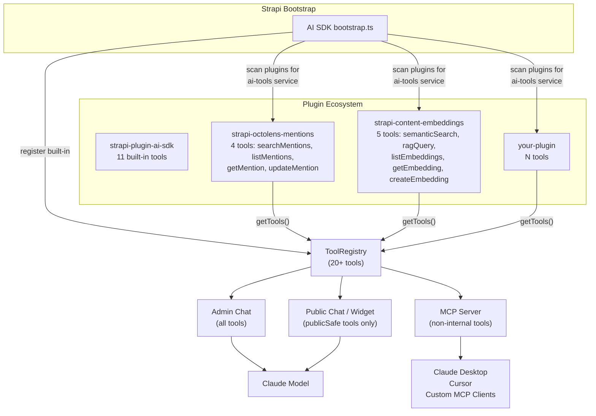
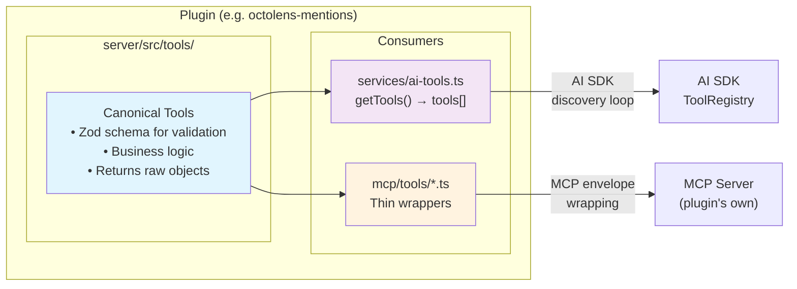
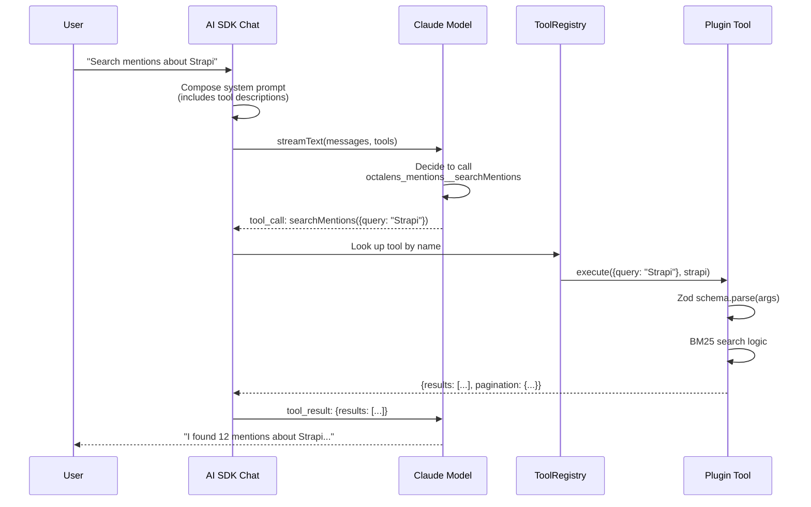
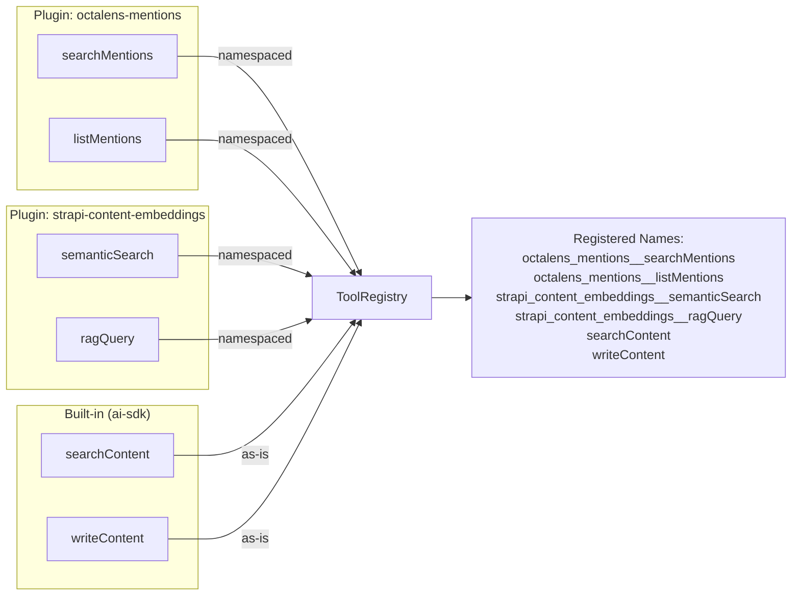
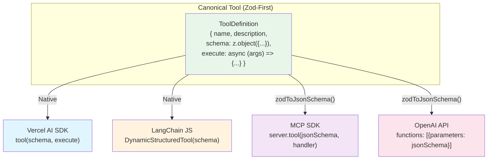

# Tool Standardization Spec

> A unified tool authoring standard for the Strapi plugin ecosystem, enabling
> write-once tools that work across AI SDK chat, MCP endpoints, and cross-plugin
> discovery — with zero duplication.

---

## Table of Contents

1. [Why Standardize](#1-why-standardize)
2. [Current State: Three Plugins, Three Patterns](#2-current-state-three-plugins-three-patterns)
3. [Two Candidate Standards](#3-two-candidate-standards)
4. [Side-by-Side: The Same Tool in Both Standards](#4-side-by-side-the-same-tool-in-both-standards)
5. [Tradeoffs: Honest Assessment](#5-tradeoffs-honest-assessment)
6. [Counter-Arguments Against the AI SDK Standard](#6-counter-arguments-against-the-ai-sdk-standard)
7. [Counter-Arguments Against the MCP-Native Standard](#7-counter-arguments-against-the-mcp-native-standard)
8. [Cross-Framework Portability](#8-cross-framework-portability)
9. [Recommendation](#9-recommendation)
10. [Architecture Diagrams](#10-architecture-diagrams)
11. [Spec A: AI SDK Standard (Zod-First)](#11-spec-a-ai-sdk-standard-zod-first)
12. [Spec B: MCP-Native Standard (JSON Schema-First)](#12-spec-b-mcp-native-standard-json-schema-first)
13. [How to Create a Tool (Both Specs)](#13-how-to-create-a-tool-both-specs)
14. [How to Register Tools for Discovery (Both Specs)](#14-how-to-register-tools-for-discovery-both-specs)
15. [How the AI SDK Discovers and Loads Tools](#15-how-the-ai-sdk-discovers-and-loads-tools)
16. [Approach Comparison: Adapter vs Rewrite](#16-approach-comparison-adapter-vs-rewrite)
17. [Migration Guide: Existing Plugins](#17-migration-guide-existing-plugins)
18. [File Change Matrix](#18-file-change-matrix)
19. [FAQ](#19-faq)

---

## 1. Why Standardize

Today, each plugin defines tools in its own format. This creates three problems:

**Problem 1 — Duplication.** To expose an octolens tool to both its own MCP
endpoint and the AI SDK, you'd need to maintain two definitions: one as a JSON
Schema MCP object and one as a Zod-based `ToolDefinition`. Same logic, two
places to update.

**Problem 2 — Inconsistency.** The embeddings plugin does no input validation on
its MCP tools (direct destructuring). The octolens plugin validates via Zod but
defines schemas separately from the tool object. The AI SDK validates via Zod
inline. Bugs hide in the gaps.

**Problem 3 — No composability.** A tool written for one plugin cannot be used by
another without manual rewrapping. The AI SDK cannot discover tools from other
plugins because there's no shared contract.

**Standardizing solves all three:** one tool definition, one validation layer,
automatic MCP conversion, automatic AI SDK discovery.

---

## 2. Current State: Three Plugins, Three Patterns

### AI SDK (`strapi-plugin-ai-sdk`)

```
Tool Logic (Zod schema + handler)  →  ToolDefinition wrapper  →  ToolRegistry  →  Chat + MCP
```

- **Schema:** Zod objects defined in `tool-logic/*.ts`
- **Handler signature:** `(strapi, args, context?) → Promise<RawObject>`
- **Return format:** Raw JS objects (plain data)
- **Naming:** camelCase (`searchContent`)
- **Validation:** Zod `.parse()` in tool-logic functions
- **11 tools**, all follow this pattern consistently

**Real example — `search-content.ts` tool definition:**

```typescript
// server/src/tools/definitions/search-content.ts (10 lines)
import { searchContent, searchContentSchema, searchContentDescription } from '../../tool-logic';
import type { ToolDefinition } from '../../lib/tool-registry';

export const searchContentTool: ToolDefinition = {
  name: 'searchContent',
  description: searchContentDescription,
  schema: searchContentSchema,
  execute: async (args, strapi) => searchContent(strapi, args),
  publicSafe: true,
};
```

```typescript
// server/src/tool-logic/search-content.ts (handler + schema, excerpt)
export const searchContentSchema = z.object({
  contentType: z.string().describe('The content type UID to search...'),
  query: z.string().optional().describe('Full-text search query string...'),
  filters: z.record(z.string(), z.unknown()).optional().describe('Strapi filter object...'),
  // ... more fields
});

export async function searchContent(
  strapi: Core.Strapi,
  params: SearchContentParams
): Promise<SearchContentResult> {
  // ... logic
  return { results: processedResults, pagination: { page, pageSize, total } };
}
```

### Octolens Mentions (`strapi-octolens-mentions-plugin`)

```
JSON Schema def + Zod schema (separate file)  →  Handler  →  MCP Server
```

- **Schema:** Dual — JSON Schema in tool file for MCP, Zod in `schemas/index.ts` for validation
- **Handler signature:** `(strapi, args) → Promise<McpEnvelope>`
- **Return format:** `{ content: [{ type: 'text', text: JSON.stringify(data) }] }`
- **Naming:** snake_case (`search_mentions`)
- **Validation:** `validateToolInput()` calls Zod `.safeParse()` from separate schema registry
- **4 tools**, all follow this pattern

**Real example — `list-mentions.ts`:**

```typescript
// server/src/mcp/tools/list-mentions.ts
export const listMentionsTool = {
  name: 'list_mentions',
  description: 'List all social mentions with pagination...',
  inputSchema: {
    type: 'object' as const,
    properties: {
      page: { type: 'number', description: 'Page number (starts at 1)' },
      pageSize: { type: 'number', description: 'Items per page (max 100)' },
      sort: { type: 'string', description: 'Sort order...' },
    },
    required: [],
  },
};

export async function handleListMentions(strapi: Core.Strapi, args: unknown) {
  const validatedArgs = validateToolInput('list_mentions', args);  // Zod in separate file
  const { page, pageSize, sort } = validatedArgs;
  // ... logic
  return {
    content: [{
      type: 'text' as const,
      text: JSON.stringify({ data: sanitizedResults, pagination: { ... } }, null, 2),
    }],
  };
}
```

### Content Embeddings (`strapi-content-embeddings`)

```
JSON Schema def  →  Handler (no validation)  →  MCP Server
```

- **Schema:** JSON Schema only (inline in tool file)
- **Handler signature:** `(strapi, args) → Promise<McpEnvelope>`
- **Return format:** `{ content: [{ type: 'text', text: JSON.stringify(data) }] }`
- **Naming:** snake_case (`semantic_search`)
- **Validation:** None — direct parameter destructuring, no Zod
- **5 tools**, all follow this pattern

**Real example — `semantic-search.ts`:**

```typescript
// server/src/mcp/tools/semantic-search.ts
export const semanticSearchTool = {
  name: 'semantic_search',
  description: 'Search for semantically similar content using vector embeddings...',
  inputSchema: {
    type: 'object',
    properties: {
      query: { type: 'string', description: 'The search query text...' },
      limit: { type: 'number', description: 'Max results (default: 5, max: 20)', default: 5 },
    },
    required: ['query'],
  },
};

export async function handleSemanticSearch(
  strapi: Core.Strapi,
  args: { query: string; limit?: number }  // No validation — trusts input
) {
  const { query, limit = 5 } = args;
  // ... logic
  return {
    content: [{
      type: 'text',
      text: JSON.stringify({ query, resultCount: results.length, results }, null, 2),
    }],
  };
}
```

### Side-by-Side Comparison

| Aspect | AI SDK | Octolens | Embeddings |
|--------|--------|----------|------------|
| Schema format | Zod | JSON Schema + Zod (separate) | JSON Schema only |
| Validation | Zod parse | Zod safeParse (separate file) | None |
| Handler args order | `(strapi, args, ctx)` | `(strapi, args)` | `(strapi, args)` |
| Return value | Raw object | MCP envelope | MCP envelope |
| Tool naming | camelCase | snake_case | snake_case |
| Context support | Yes (adminUserId) | No | No |
| Tools count | 11 | 4 | 5 |

---

## 3. Two Candidate Standards

There are two legitimate paths to standardization. Neither is objectively wrong.
This section defines both fully so you can compare.

### Standard A: AI SDK Format (Zod-First)

The tool is defined with a **Zod schema** and returns **raw objects**. MCP
format is generated automatically via `toMcpTool()`.

**Flow:** `Zod + Raw → (auto-convert) → MCP JSON Schema + Envelope`

### Standard B: MCP-Native Format (JSON Schema-First)

The tool is defined with a **JSON Schema** and returns **MCP envelopes**. The
AI SDK wraps it with a thin adapter for its registry.

**Flow:** `JSON Schema + MCP Envelope → (adapter) → AI SDK ToolDefinition`

---

## 4. Side-by-Side: The Same Tool in Both Standards

Below is the **exact same tool** — `semanticSearch` from the embeddings plugin —
written in both standards. This is real, implementable code.

### Standard A: AI SDK Format (Zod-First)

```typescript
// server/src/tools/definitions/semantic-search.ts

import type { Core } from '@strapi/strapi';
import { z } from 'zod';

// ── Schema (Zod) ─────────────────────────────────────────────
export const semanticSearchSchema = z.object({
  query: z.string().describe('Natural language search query to find similar content'),
  limit: z
    .number()
    .min(1)
    .max(20)
    .optional()
    .default(5)
    .describe('Maximum number of results to return'),
});

export type SemanticSearchParams = z.infer<typeof semanticSearchSchema>;

// ── Handler (returns raw object) ─────────────────────────────
export async function semanticSearch(
  strapi: Core.Strapi,
  params: SemanticSearchParams
): Promise<SemanticSearchResult> {
  const pluginManager = (strapi as any).contentEmbeddingsManager;
  if (!pluginManager) {
    throw new Error('Content embeddings plugin not initialized');
  }

  const results = await pluginManager.similaritySearch(params.query, params.limit);

  return {
    query: params.query,
    resultCount: results.length,
    results: results.map((doc: any, i: number) => ({
      rank: i + 1,
      content: doc.pageContent,
      metadata: doc.metadata,
      score: doc.score || null,
    })),
  };
}

// ── Tool Definition ──────────────────────────────────────────
// This object is consumed by BOTH:
//   - AI SDK tool registry (directly)
//   - Plugin's own MCP server (via toMcpTool utility)
export const semanticSearchTool: ToolDefinition = {
  name: 'semanticSearch',
  description:
    'Search for semantically similar content using vector embeddings. ' +
    'Finds relevant documents by meaning, not just keywords.',
  schema: semanticSearchSchema,
  execute: async (args, strapi) => {
    const validated = semanticSearchSchema.parse(args);
    return semanticSearch(strapi, validated);
  },
  publicSafe: true,
};
```

```typescript
// server/src/mcp/server.ts — MCP auto-generated from same definition
import { tools } from '../tools/definitions';
import { toMcpTool } from '../utils/to-mcp-tool';

export function createMcpServer(strapi) {
  const server = new McpServer({ name: 'embeddings-mcp', version: '1.0.0' },
    { capabilities: { tools: {} } });

  for (const tool of tools) {
    const { definition, handler } = toMcpTool(tool);
    server.registerTool(definition.name, /* ... */);
    // tool.name "semanticSearch" → MCP name "semantic_search" (auto)
    // tool returns raw object → toMcpTool wraps in MCP envelope (auto)
  }

  return server;
}
```

```typescript
// server/src/services/ai-tools.ts — discovery service
import { tools } from '../tools/definitions';

export default ({ strapi }) => ({
  getTools() {
    return tools;  // Same array used by MCP server
  },
});
```

**What you write:** 1 file per tool (schema + handler + definition)
**What's generated:** MCP definition, MCP envelope wrapping, snake_case naming

---

### Standard B: MCP-Native Format (JSON Schema-First)

```typescript
// server/src/mcp/tools/semantic-search.ts

import type { Core } from '@strapi/strapi';

// ── Schema (JSON Schema) ────────────────────────────────────
export const semanticSearchTool = {
  name: 'semantic_search',
  description:
    'Search for semantically similar content using vector embeddings. ' +
    'Finds relevant documents by meaning, not just keywords.',
  inputSchema: {
    type: 'object' as const,
    properties: {
      query: {
        type: 'string',
        description: 'Natural language search query to find similar content',
      },
      limit: {
        type: 'number',
        description: 'Maximum number of results to return (default: 5, max: 20)',
        default: 5,
      },
    },
    required: ['query'] as const,
  },
};

// ── Handler (returns MCP envelope) ──────────────────────────
export async function handleSemanticSearch(
  strapi: Core.Strapi,
  args: { query: string; limit?: number }
) {
  const { query, limit = 5 } = args;
  const maxLimit = Math.min(limit, 20);

  const pluginManager = (strapi as any).contentEmbeddingsManager;
  if (!pluginManager) {
    throw new Error('Content embeddings plugin not initialized');
  }

  const results = await pluginManager.similaritySearch(query, maxLimit);

  const formattedResults = results.map((doc: any, i: number) => ({
    rank: i + 1,
    content: doc.pageContent,
    metadata: doc.metadata,
    score: doc.score || null,
  }));

  return {
    content: [
      {
        type: 'text' as const,
        text: JSON.stringify(
          { query, resultCount: formattedResults.length, results: formattedResults },
          null,
          2
        ),
      },
    ],
  };
}
```

```typescript
// server/src/services/ai-tools.ts — adapter for AI SDK discovery
import { z } from 'zod';
import { handleSemanticSearch } from '../mcp/tools/semantic-search';

function unwrapMcp(mcpResult: any): unknown {
  try { return JSON.parse(mcpResult.content[0].text); }
  catch { return mcpResult; }
}

export default ({ strapi }) => ({
  getTools() {
    return [
      {
        name: 'semanticSearch',
        description: 'Search for semantically similar content using vector embeddings...',
        schema: z.object({
          query: z.string().describe('Natural language search query...'),
          limit: z.number().min(1).max(20).optional().default(5).describe('Max results'),
        }),
        execute: async (args: any, strapi: any) =>
          unwrapMcp(await handleSemanticSearch(strapi, args)),
        publicSafe: true,
      },
      // ... repeat for every tool
    ];
  },
});
```

**What you write:** 1 MCP file per tool + 1 adapter file with ALL tool wrappers
**What's manual:** Zod schema in adapter (duplicates JSON Schema), MCP unwrapping, name conversion

---

### Direct Comparison: Same Tool, Both Standards

| Aspect | Standard A (Zod-First) | Standard B (MCP-Native) |
|--------|------------------------|-------------------------|
| **Files per tool** | 1 (schema + handler + def) | 1 MCP file + adapter entry in ai-tools.ts |
| **Schema defined** | Once (Zod) | Twice (JSON Schema in tool + Zod in adapter) |
| **Description written** | Once | Twice (tool def + adapter) |
| **Validation** | Automatic (Zod parse in execute) | Manual in handler (or none, like today) |
| **Return format** | Raw object (transport-agnostic) | MCP envelope (must unwrap for AI SDK) |
| **MCP compatibility** | Auto via `toMcpTool()` | Native |
| **AI SDK compatibility** | Native | Manual adapter |
| **Type safety** | Full (`z.infer<typeof schema>`) | Partial (TypeScript inline types) |
| **Adding a new tool** | Add 1 file, export from index | Add 1 MCP file + update adapter + duplicate schema |
| **Updating a tool** | Change 1 file | Change MCP file + update adapter if schema changed |
| **Lines of code (this tool)** | ~50 (tool) + 0 (adapter) | ~40 (tool) + ~15 (adapter) |

---

## 5. Tradeoffs: Honest Assessment

### You Are Choosing Between Two Valid Philosophies

| Philosophy | Standard A (Zod-First) | Standard B (MCP-Native) |
|------------|------------------------|-------------------------|
| **Core belief** | "Tools are internal functions. MCP is one of many transports." | "MCP is the industry standard. Everything else adapts to it." |
| **Optimizes for** | Internal consistency, type safety, DRY | External interoperability, MCP ecosystem compatibility |
| **Pain point** | Requires `toMcpTool()` conversion for MCP | Requires adapters for non-MCP consumers (AI SDK) |
| **Who benefits most** | Plugin authors building in your ecosystem | Plugin authors coming from the MCP ecosystem |

### What You Gain vs What You Pay

**Standard A gains:**
- One source of truth per tool (schema + handler + definition = 1 file)
- Zod validation everywhere (catches the embeddings plugin's current zero-validation gap)
- TypeScript inference (`z.infer`) for handler parameters
- New tools auto-available in MCP and AI SDK with zero extra work
- Raw return values → testable without MCP envelope parsing

**Standard A pays:**
- Every plugin needs `toMcpTool()` utility (~30 lines, copy-paste or shared)
- `zod-to-json-schema` dependency (or MCP SDK's native Zod support)
- Plugin authors must learn Zod (though all three plugins already use it)
- camelCase → snake_case naming transform adds a layer of indirection

**Standard B gains:**
- Tools work with Claude Desktop / MCP Inspector / any MCP client out of the box
- No conversion utilities needed for MCP
- Familiar to anyone coming from the MCP ecosystem
- snake_case is the MCP convention — no translation needed

**Standard B pays:**
- Schema duplication: JSON Schema for MCP + Zod for AI SDK adapter
- Description duplication: written in tool file + repeated in adapter
- Adapter maintenance: every tool update may require adapter update
- No input validation unless you add it yourself (embeddings plugin proves this)
- No TypeScript inference from JSON Schema (manual type annotations)

---

## 6. Counter-Arguments Against the AI SDK Standard

These are real concerns, not strawmen.

### "You're making AI SDK the standard-setter for the whole ecosystem"

**True.** If `ToolDefinition` changes, every contributing plugin must adapt.
This creates a form of coupling — not at runtime (it's type-only), but at the
design level. You're centralizing a contract in one plugin.

**Mitigation:** The interface is 7 fields, 3 of which are optional. It has been
stable across 11 tools. The risk of churn is low. If it does change, the
compiler catches it.

**But consider:** someone has to own the contract. If not AI SDK, then who?
A shared package adds overhead. An informal convention has no type checking.

### "MCP is the industry standard, not your plugin"

**True.** MCP is backed by Anthropic, adopted by Claude Desktop, Cursor, and
dozens of tools. Your Zod-first format is bespoke to your ecosystem. A plugin
author who's built MCP servers before will expect JSON Schema and MCP envelopes.

**Mitigation:** MCP tools still work. The plugin's own MCP endpoint is generated
from the canonical definition via `toMcpTool()`. The wire format is identical.

**But consider:** you're adding a translation layer that doesn't exist in the
MCP ecosystem. Every other MCP server in the world uses JSON Schema directly.

### "Zod is a runtime dependency you're imposing on every plugin"

**Partially true.** Zod is already used in all three plugins, but making it
the canonical schema format means new plugins can't avoid it. Some authors
may prefer `yup`, `ajv`, or plain JSON Schema.

**Mitigation:** Zod is 13KB gzipped, has zero dependencies, and is the de facto
standard for TypeScript validation. Strapi itself uses it internally.

### "camelCase → snake_case conversion creates debugging confusion"

**True.** When an MCP client logs `semantic_search` but your code says
`semanticSearch`, it's a paper cut. When a tool fails, you have to mentally
translate names to find the source code.

**Mitigation:** The conversion is deterministic and greppable. `toSnakeCase`
is 1 line. IDE search handles both.

### "Context passing (adminUserId) is AI-SDK-specific"

**True.** MCP tools don't have a concept of user context. By putting
`context?: ToolContext` in the standard interface, you're encoding an
AI-SDK-specific concern into the universal contract.

**Mitigation:** Context is optional. MCP-only tools ignore it. The parameter
exists but doesn't impose behavior.

---

## 7. Counter-Arguments Against the MCP-Native Standard

### "JSON Schema can't generate Zod, but Zod can generate JSON Schema"

**True.** This is the fundamental asymmetry. If you start with Zod, you can
auto-generate JSON Schema for MCP. If you start with JSON Schema, you must
hand-write Zod schemas for the AI SDK adapter. This means Standard B requires
duplicate schema maintenance; Standard A does not.

### "No validation by default — and we have proof"

**True.** The embeddings plugin has 5 MCP tools with zero input validation.
The handler does `const { query, limit = 5 } = args` with no type checking,
no bounds checking, no error messaging. This is a bug in production today.
Standard B doesn't fix this — it preserves the existing pattern. Standard A
forces Zod validation as part of the definition.

### "Adapter files become repetitive bloat"

**True.** The `ai-tools.ts` adapter for the embeddings plugin would be ~80 lines
of mechanical wrapping:
- 5 `unwrapMcp()` calls
- 5 duplicate Zod schemas
- 5 duplicate descriptions
- 5 name conversions

For octolens it's ~60 lines. Every new tool adds ~15 lines to the adapter.
This is the kind of code that drifts out of sync.

### "You're coupling every tool to a transport format (MCP)"

**True.** When a handler returns `{ content: [{ type: 'text', text: JSON.stringify(...) }] }`,
it's encoding MCP wire format into business logic. This means:
- Unit tests must parse MCP envelopes to check results
- Non-MCP consumers (AI SDK chat, REST API, CLI) must unwrap the envelope
- The handler can't be called directly as a library function

Standard A's raw returns are transport-agnostic. The wrapping happens at the
transport layer where it belongs.

### "Two sources of truth for tool descriptions"

**True.** In Standard B, the MCP tool object has `description: '...'` and the
AI SDK adapter also has `description: '...'`. These can drift. When someone
improves the description in the MCP tool, they must remember to update the
adapter. When they don't, the AI SDK sees a stale description and makes worse
tool-selection decisions.

---

## 8. Cross-Framework Portability

A tool defined in your ecosystem shouldn't be locked to your ecosystem. You may
want to reuse the same tools with LangChain agents, Vercel AI SDK applications,
MCP clients like Claude Desktop, or direct OpenAI API calls. This section
examines what each framework expects and which canonical format is the most
portable starting point.

### What Every Major Framework Accepts

| Framework | Package | Schema format | Handler return | Accepts Zod? |
|-----------|---------|---------------|----------------|--------------|
| **LangChain JS** | `@langchain/core/tools` | Zod or JSON Schema | `string` or any serializable | **Yes (primary)** |
| **Vercel AI SDK** | `ai` | Zod, JSON Schema, or Standard Schema | Any serializable / AsyncIterable | **Yes (primary)** |
| **MCP SDK** | `@modelcontextprotocol/sdk` | Zod (auto-converts to JSON Schema on wire) | MCP envelope `{ content: [...] }` | **Yes (primary)** |
| **OpenAI API** | REST / `openai` | JSON Schema only | JSON string in `tool` message | No (JSON Schema only) |

**Zod is the common denominator.** LangChain, Vercel AI SDK, and MCP SDK all
accept Zod schemas as their primary input. The only outlier is raw OpenAI API
calls, which require JSON Schema — but Zod generates JSON Schema trivially
(via `zod-to-json-schema` or built-in methods).

**Raw return values are the most adaptable.** Each framework wraps results
differently — LangChain expects strings, MCP expects envelopes, Vercel AI SDK
expects plain objects. If your handler returns a raw object, a 1-line wrapper
adapts it to any format. If your handler returns an MCP envelope, every non-MCP
consumer must unwrap it first.

### The Portability Diagram

```
                Your Canonical Tool
                (Zod schema + raw object return)
                         │
         ┌───────────────┼──────────────────────┐
         │               │                      │
         │               │                      │
    ┌────▼────┐    ┌─────▼──────┐    ┌──────────▼──────────┐
    │ toMcp   │    │ toLangChain│    │  toVercelAi         │
    │ Tool()  │    │ Tool()     │    │  Tool()             │
    │ ~15 ln  │    │ ~10 ln     │    │  ~8 ln              │
    └────┬────┘    └─────┬──────┘    └──────────┬──────────┘
         │               │                      │
    ┌────▼────┐    ┌─────▼──────┐    ┌──────────▼──────────┐
    │   MCP   │    │ LangChain  │    │   Vercel AI SDK     │
    │ clients │    │  agents    │    │   applications      │
    │ Claude  │    │  chains    │    │   Next.js routes    │
    │ Desktop │    │  RAG pipes │    │   streaming chat    │
    └─────────┘    └────────────┘    └─────────────────────┘
```

Each converter is trivial because the hard part — schema definition, validation,
and business logic — lives in the canonical tool. The converters only reshape
the interface.

### Converter: Canonical → LangChain

```typescript
// utils/to-langchain-tool.ts
import { tool as lcTool } from '@langchain/core/tools';
import type { Core } from '@strapi/strapi';
import type { ToolDefinition } from '../types';

/**
 * Convert a canonical ToolDefinition into a LangChain DynamicStructuredTool.
 *
 * LangChain's tool() function accepts Zod schemas directly and expects
 * the handler to return a string (or any serializable value for newer versions).
 */
export function toLangChainTool(def: ToolDefinition, strapi: Core.Strapi) {
  return lcTool(
    async (input) => {
      const result = await def.execute(input, strapi);
      return typeof result === 'string' ? result : JSON.stringify(result);
    },
    {
      name: def.name,
      description: def.description,
      schema: def.schema,
    }
  );
}

// Usage:
// const lcTools = tools.map(t => toLangChainTool(t, strapi));
// const agent = createReactAgent({ llm, tools: lcTools });
```

### Converter: Canonical → Vercel AI SDK

```typescript
// utils/to-vercel-ai-tool.ts
import { tool as aiTool } from 'ai';
import type { Core } from '@strapi/strapi';
import type { ToolDefinition } from '../types';

/**
 * Convert a canonical ToolDefinition into a Vercel AI SDK tool.
 *
 * Vercel AI SDK renamed "parameters" to "inputSchema" in v5 to align
 * with MCP. It accepts Zod schemas directly.
 */
export function toVercelAiTool(def: ToolDefinition, strapi: Core.Strapi) {
  return aiTool({
    description: def.description,
    inputSchema: def.schema,
    execute: async (input) => def.execute(input, strapi),
  });
}

// Usage:
// const tools = Object.fromEntries(
//   canonicalTools.map(t => [t.name, toVercelAiTool(t, strapi)])
// );
// const result = await generateText({ model, tools, prompt });
```

### Converter: Canonical → MCP

```typescript
// utils/to-mcp-tool.ts  (already shown in Spec A)
import type { Core } from '@strapi/strapi';
import type { ToolDefinition } from '../types';

function toSnakeCase(str: string): string {
  return str.replace(/[A-Z]/g, (l) => `_${l.toLowerCase()}`);
}

/**
 * Convert a canonical ToolDefinition into an MCP tool registration.
 *
 * MCP SDK's registerTool() accepts Zod schemas directly and converts
 * them to JSON Schema over the wire. The handler must return the MCP
 * envelope format: { content: [{ type: 'text', text: '...' }] }
 */
export function toMcpTool(def: ToolDefinition) {
  return {
    definition: {
      name: toSnakeCase(def.name),
      description: def.description,
      inputSchema: def.schema,  // MCP SDK accepts Zod directly
    },
    handler: async (strapi: Core.Strapi, args: unknown) => {
      const result = await def.execute(args, strapi);
      return {
        content: [{
          type: 'text' as const,
          text: JSON.stringify(result, null, 2),
        }],
      };
    },
  };
}
```

### Converter: Canonical → OpenAI Function Calling

```typescript
// utils/to-openai-tool.ts
import { zodToJsonSchema } from 'zod-to-json-schema';
import type { ToolDefinition } from '../types';

/**
 * Convert a canonical ToolDefinition into an OpenAI function calling tool.
 *
 * OpenAI is the only major framework that does NOT accept Zod directly.
 * It requires JSON Schema. zod-to-json-schema handles the conversion.
 *
 * Note: OpenAI does not have a handler concept — you dispatch tool calls
 * yourself based on the tool_calls array in the response.
 */
export function toOpenAiFunctionDef(def: ToolDefinition) {
  const jsonSchema = zodToJsonSchema(def.schema, {
    target: 'openApi3',
    $refStrategy: 'none',
  });

  return {
    type: 'function' as const,
    function: {
      name: def.name,
      description: def.description,
      parameters: jsonSchema,
    },
  };
}

/**
 * Dispatch an OpenAI tool call to the matching canonical handler.
 */
export async function executeOpenAiToolCall(
  toolCall: { function: { name: string; arguments: string } },
  tools: ToolDefinition[],
  strapi: Core.Strapi
): Promise<string> {
  const tool = tools.find(t => t.name === toolCall.function.name);
  if (!tool) throw new Error(`Unknown tool: ${toolCall.function.name}`);

  const args = JSON.parse(toolCall.function.arguments);
  const result = await tool.execute(args, strapi);
  return JSON.stringify(result);
}

// Usage:
// const response = await openai.chat.completions.create({
//   model: 'gpt-4o',
//   tools: canonicalTools.map(toOpenAiFunctionDef),
//   messages,
// });
// for (const call of response.choices[0].message.tool_calls) {
//   const result = await executeOpenAiToolCall(call, canonicalTools, strapi);
// }
```

### What If You Started MCP-Native Instead?

If tools were defined with JSON Schema + MCP envelopes (Standard B), here's
what each converter would need to do:

| Target | From Zod + Raw (Standard A) | From JSON Schema + MCP Envelope (Standard B) |
|--------|----------------------------|----------------------------------------------|
| **LangChain** | Pass `schema` directly, `JSON.stringify(result)` | Recreate Zod schema from scratch, `JSON.parse(result.content[0].text)` then re-stringify |
| **Vercel AI SDK** | Pass `schema` directly, return result | Recreate Zod schema, unwrap MCP envelope |
| **MCP** | Wrap result in envelope (~3 lines) | Native — no conversion |
| **OpenAI** | `zodToJsonSchema()` (~1 line) | Native — no conversion |
| **AI SDK Chat** | Native — no conversion | Recreate Zod schema, unwrap MCP envelope |

**Standard A requires trivial wrapping for MCP/OpenAI (the two JSON Schema consumers).**
**Standard B requires full schema recreation for LangChain/Vercel/AI SDK (the three Zod consumers).**

Since 3 of 5 targets prefer Zod and all accept it, Zod-first is the path of
least resistance for maximum portability.

### Real-World Example: One Tool, Four Frameworks

Given the canonical `semanticSearch` tool from Section 10, here's how you'd
use it across all four frameworks — no changes to the tool itself:

```typescript
import { semanticSearchTool } from './tools/definitions/semantic-search';

// ── AI SDK (native) ──────────────────────────────────────────
toolRegistry.register(semanticSearchTool);

// ── MCP ──────────────────────────────────────────────────────
const { definition, handler } = toMcpTool(semanticSearchTool);
mcpServer.registerTool(definition.name, definition, (args) => handler(strapi, args));

// ── LangChain ────────────────────────────────────────────────
const lcTool = toLangChainTool(semanticSearchTool, strapi);
const agent = createReactAgent({ llm: chatModel, tools: [lcTool] });

// ── Vercel AI SDK ────────────────────────────────────────────
const result = await generateText({
  model: anthropic('claude-sonnet-4-20250514'),
  tools: { semanticSearch: toVercelAiTool(semanticSearchTool, strapi) },
  prompt: 'Find articles about authentication',
});

// ── OpenAI ───────────────────────────────────────────────────
const response = await openai.chat.completions.create({
  model: 'gpt-4o',
  tools: [toOpenAiFunctionDef(semanticSearchTool)],
  messages: [{ role: 'user', content: 'Find articles about authentication' }],
});
```

**One tool definition. Five consumers. Zero duplication.**

---

## 9. Recommendation

**Use Standard A (Zod-First / AI SDK format)** for these reasons:

1. **DRY wins.** One schema, one description, one handler per tool. Standard B
   requires duplicating all three in the adapter.

2. **Validation wins.** Standard A forces validation. Standard B allows tools
   with no validation (and we have proof this happens in production).

3. **The asymmetry is decisive.** Zod → JSON Schema is automatic. JSON Schema →
   Zod is manual. This alone tips the balance.

4. **MCP compatibility is not sacrificed.** The `toMcpTool()` utility generates
   MCP-compatible definitions. The wire format is identical. No MCP client can
   tell the difference.

5. **Existing codebase leans this way.** 11 of 20 tools (55%) already use the AI
   SDK format. Both other plugins already use Zod internally. The migration is
   toward the majority pattern, not away from it.

**However:** if your plugin ecosystem grows to include third-party authors who
primarily build MCP servers, revisit this decision. At that point, Standard B
(or a shared neutral format) may reduce friction for contributors.

---

## 10. Architecture Diagrams

### System Overview — Tool Discovery & Consumption



### Canonical Tool Architecture — Single Source of Truth



### Data Flow — From User Message to Tool Execution



### Tool Namespacing



### Cross-Framework Portability



---

## 11. Spec A: AI SDK Standard (Zod-First)

### Canonical Interface

```typescript
import type { Core } from '@strapi/strapi';
import type { z } from 'zod';

export interface ToolContext {
  adminUserId?: number;
}

export interface ToolDefinition {
  /** Unique tool name in camelCase (e.g., "searchMentions") */
  name: string;

  /** Human-readable description for the AI model.
   *  Be specific about WHEN to use this tool and what it returns. */
  description: string;

  /** Zod schema defining accepted parameters.
   *  Every field must have .describe() for the AI model. */
  schema: z.ZodObject<any>;

  /** Handler that executes the tool logic.
   *  Must return a raw JS object (no MCP envelopes). */
  execute: (
    args: any,
    strapi: Core.Strapi,
    context?: ToolContext
  ) => Promise<unknown>;

  /** If true, only available in AI SDK admin chat. Not exposed via MCP. */
  internal?: boolean;

  /** If true, safe for unauthenticated public chat (read-only). */
  publicSafe?: boolean;
}
```

### Rules

1. **One file per tool.** Schema, handler, and definition live together.
2. **Zod schemas are the source of truth.** Use `.describe()` on every field.
3. **Handlers return raw objects.** Never return MCP envelopes.
4. **Validate in `execute`.** Call `schema.parse(args)` before the handler.
5. **Names are camelCase.** MCP conversion is automatic.
6. **Context is optional.** Only use it if you need `adminUserId`.
7. **Throw on errors.** The registry catches and formats them.

### MCP Conversion Utility

```typescript
// server/src/utils/to-mcp-tool.ts
import type { Core } from '@strapi/strapi';

function toSnakeCase(str: string): string {
  return str.replace(/[A-Z]/g, (l) => `_${l.toLowerCase()}`);
}

export function toMcpTool(tool: ToolDefinition) {
  return {
    definition: {
      name: toSnakeCase(tool.name),
      description: tool.description,
      inputSchema: tool.schema,  // MCP SDK accepts Zod shapes directly
    },
    handler: async (strapi: Core.Strapi, args: unknown) => {
      const result = await tool.execute(args, strapi);
      return {
        content: [{
          type: 'text' as const,
          text: JSON.stringify(result, null, 2),
        }],
      };
    },
  };
}
```

### Full Example: Embeddings `semanticSearch` Tool

```typescript
// server/src/tools/definitions/semantic-search.ts

import type { Core } from '@strapi/strapi';
import { z } from 'zod';

// ── Schema ───────────────────────────────────────────────────
export const semanticSearchSchema = z.object({
  query: z.string().describe('Natural language search query to find similar content'),
  limit: z.number().min(1).max(20).optional().default(5)
    .describe('Maximum number of results to return'),
});

export type SemanticSearchParams = z.infer<typeof semanticSearchSchema>;

export interface SemanticSearchResult {
  query: string;
  resultCount: number;
  results: Array<{
    rank: number;
    content: string;
    metadata: Record<string, unknown>;
    score: number | null;
  }>;
}

// ── Handler ──────────────────────────────────────────────────
export async function semanticSearch(
  strapi: Core.Strapi,
  params: SemanticSearchParams
): Promise<SemanticSearchResult> {
  const pluginManager = (strapi as any).contentEmbeddingsManager;
  if (!pluginManager) {
    throw new Error('Content embeddings plugin not initialized');
  }

  const results = await pluginManager.similaritySearch(params.query, params.limit);

  return {
    query: params.query,
    resultCount: results.length,
    results: results.map((doc: any, i: number) => ({
      rank: i + 1,
      content: doc.pageContent,
      metadata: doc.metadata,
      score: doc.score || null,
    })),
  };
}

// ── Tool Definition ──────────────────────────────────────────
export const semanticSearchTool: ToolDefinition = {
  name: 'semanticSearch',
  description:
    'Search for semantically similar content using vector embeddings. ' +
    'Finds relevant documents by meaning, not just keywords.',
  schema: semanticSearchSchema,
  execute: async (args, strapi) => {
    const validated = semanticSearchSchema.parse(args);
    return semanticSearch(strapi, validated);
  },
  publicSafe: true,
};
```

### Full Example: Octolens `listMentions` Tool

```typescript
// server/src/tools/definitions/list-mentions.ts

import type { Core } from '@strapi/strapi';
import { z } from 'zod';

const MENTION_UID = 'plugin::octalens-mentions.mention';

// ── Schema ───────────────────────────────────────────────────
export const listMentionsSchema = z.object({
  page: z.number().min(1).optional().default(1).describe('Page number (starts at 1)'),
  pageSize: z.number().min(1).max(100).optional().default(25)
    .describe('Items per page (max 100)'),
  sort: z.string().optional().default('createdAt:desc')
    .describe('Sort order (e.g., "createdAt:desc")'),
});

export type ListMentionsParams = z.infer<typeof listMentionsSchema>;

// ── Handler ──────────────────────────────────────────────────
export async function listMentions(
  strapi: Core.Strapi,
  params: ListMentionsParams
) {
  const results = await strapi.documents(MENTION_UID as any).findMany({
    sort: [params.sort],
    limit: params.pageSize,
    start: (params.page - 1) * params.pageSize,
  });

  const total = await strapi.documents(MENTION_UID as any).count({});

  return {
    data: results,
    pagination: {
      page: params.page,
      pageSize: params.pageSize,
      total,
      pageCount: Math.ceil(total / params.pageSize),
    },
  };
}

// ── Tool Definition ──────────────────────────────────────────
export const listMentionsTool: ToolDefinition = {
  name: 'listMentions',
  description:
    'List all social mentions with pagination. ' +
    'Returns newest first by default. Use searchMentions for filtering.',
  schema: listMentionsSchema,
  execute: async (args, strapi) => {
    const validated = listMentionsSchema.parse(args);
    return listMentions(strapi, validated);
  },
  publicSafe: true,
};
```

---

## 12. Spec B: MCP-Native Standard (JSON Schema-First)

### Canonical Interface

```typescript
import type { Core } from '@strapi/strapi';

export interface McpToolDefinition {
  /** Unique tool name in snake_case (e.g., "search_mentions") */
  name: string;

  /** Human-readable description for the AI model */
  description: string;

  /** JSON Schema object defining accepted parameters */
  inputSchema: {
    type: 'object';
    properties: Record<string, {
      type: string;
      description: string;
      default?: unknown;
      enum?: string[];
    }>;
    required: string[];
  };
}

export type McpToolHandler = (
  strapi: Core.Strapi,
  args: unknown
) => Promise<{
  content: Array<{ type: 'text'; text: string }>;
}>;
```

### Rules

1. **One file per tool.** Definition and handler live together.
2. **JSON Schema for inputSchema.** Every property must have `description`.
3. **Handlers return MCP envelopes.** `{ content: [{ type: 'text', text: ... }] }`
4. **Names are snake_case.** Matches MCP convention.
5. **Add Zod validation explicitly** if you want it (in the handler, not the schema).
6. **No context parameter.** MCP has no user context concept.

### AI SDK Adapter Utility

Each plugin that wants AI SDK discovery provides an adapter:

```typescript
// server/src/services/ai-tools.ts
import { z } from 'zod';

/** Unwrap MCP envelope to get the raw result object */
function unwrapMcp(mcpResult: any): unknown {
  try {
    return JSON.parse(mcpResult.content[0].text);
  } catch {
    return mcpResult;
  }
}

/** Convert snake_case to camelCase for AI SDK */
function toCamelCase(str: string): string {
  return str.replace(/_([a-z])/g, (_, c) => c.toUpperCase());
}
```

### Full Example: Embeddings `semantic_search` Tool

```typescript
// server/src/mcp/tools/semantic-search.ts  (THE TOOL — MCP native)

import type { Core } from '@strapi/strapi';

export const semanticSearchTool = {
  name: 'semantic_search',
  description:
    'Search for semantically similar content using vector embeddings. ' +
    'Finds relevant documents by meaning, not just keywords.',
  inputSchema: {
    type: 'object' as const,
    properties: {
      query: {
        type: 'string',
        description: 'Natural language search query to find similar content',
      },
      limit: {
        type: 'number',
        description: 'Maximum number of results to return (default: 5, max: 20)',
        default: 5,
      },
    },
    required: ['query'] as const,
  },
};

export async function handleSemanticSearch(
  strapi: Core.Strapi,
  args: { query: string; limit?: number }
) {
  const { query, limit = 5 } = args;
  const maxLimit = Math.min(limit, 20);

  const pluginManager = (strapi as any).contentEmbeddingsManager;
  if (!pluginManager) {
    throw new Error('Content embeddings plugin not initialized');
  }

  const results = await pluginManager.similaritySearch(query, maxLimit);

  return {
    content: [{
      type: 'text' as const,
      text: JSON.stringify({
        query,
        resultCount: results.length,
        results: results.map((doc: any, i: number) => ({
          rank: i + 1,
          content: doc.pageContent,
          metadata: doc.metadata,
          score: doc.score || null,
        })),
      }, null, 2),
    }],
  };
}
```

```typescript
// server/src/services/ai-tools.ts  (THE ADAPTER — for AI SDK discovery)

import { z } from 'zod';
import { handleSemanticSearch } from '../mcp/tools/semantic-search';
import { handleRagQuery } from '../mcp/tools/rag-query';
import { handleListEmbeddings } from '../mcp/tools/list-embeddings';
import { handleGetEmbedding } from '../mcp/tools/get-embedding';
import { handleCreateEmbedding } from '../mcp/tools/create-embedding';

function unwrapMcp(mcpResult: any): unknown {
  try { return JSON.parse(mcpResult.content[0].text); }
  catch { return mcpResult; }
}

export default ({ strapi }) => ({
  getTools() {
    return [
      {
        name: 'semanticSearch',
        description:
          'Search for semantically similar content using vector embeddings. ' +
          'Finds relevant documents by meaning, not just keywords.',
        schema: z.object({
          query: z.string().describe('Natural language search query...'),
          limit: z.number().min(1).max(20).optional().default(5)
            .describe('Maximum number of results'),
        }),
        execute: async (args: any, strapi: any) =>
          unwrapMcp(await handleSemanticSearch(strapi, args)),
        publicSafe: true,
      },
      {
        name: 'ragQuery',
        description: 'Ask a question answered using embedded content (RAG)...',
        schema: z.object({
          query: z.string().describe('Question to answer...'),
          includeSourceDocuments: z.boolean().optional().describe('Include sources'),
        }),
        execute: async (args: any, strapi: any) =>
          unwrapMcp(await handleRagQuery(strapi, args)),
        publicSafe: true,
      },
      // ... 3 more tools, each ~12 lines
      // Total: ~80 lines of adapter wrappers
    ];
  },
});
```

### Full Example: Octolens `list_mentions` Tool

```typescript
// server/src/mcp/tools/list-mentions.ts  (THE TOOL — unchanged from today)

import type { Core } from '@strapi/strapi';
import { validateToolInput } from '../schemas';
import { sanitizeOutput } from '../utils/sanitize';

const MENTION_UID = 'plugin::octalens-mentions.mention';

export const listMentionsTool = {
  name: 'list_mentions',
  description: 'List all social mentions with pagination...',
  inputSchema: {
    type: 'object' as const,
    properties: {
      page: { type: 'number', description: 'Page number (starts at 1)' },
      pageSize: { type: 'number', description: 'Items per page (max 100)' },
      sort: { type: 'string', description: 'Sort order...' },
    },
    required: [],
  },
};

export async function handleListMentions(strapi: Core.Strapi, args: unknown) {
  const validatedArgs = validateToolInput('list_mentions', args);
  const { page, pageSize, sort } = validatedArgs;

  const results = await strapi.documents(MENTION_UID as any).findMany({
    sort: sort ? [sort] : ['createdAt:desc'],
    limit: pageSize,
    start: (page - 1) * pageSize,
  });

  const total = await strapi.documents(MENTION_UID as any).count({});
  const sanitizedResults = await sanitizeOutput(strapi, results);

  return {
    content: [{
      type: 'text' as const,
      text: JSON.stringify({
        data: sanitizedResults,
        pagination: { page, pageSize, total, pageCount: Math.ceil(total / pageSize) },
      }, null, 2),
    }],
  };
}
```

```typescript
// server/src/services/ai-tools.ts  (THE ADAPTER)

import { z } from 'zod';
import { handleListMentions } from '../mcp/tools/list-mentions';
import { handleSearchMentions } from '../mcp/tools/search-mentions';
import { handleGetMention } from '../mcp/tools/get-mention';
import { handleUpdateMention } from '../mcp/tools/update-mention';

function unwrapMcp(mcpResult: any): unknown {
  try { return JSON.parse(mcpResult.content[0].text); }
  catch { return mcpResult; }
}

export default ({ strapi }) => ({
  getTools() {
    return [
      {
        name: 'listMentions',
        description: 'List all social mentions with pagination...',
        schema: z.object({
          page: z.number().min(1).optional().default(1).describe('Page number'),
          pageSize: z.number().min(1).max(100).optional().default(25)
            .describe('Items per page'),
          sort: z.string().optional().default('createdAt:desc')
            .describe('Sort order'),
        }),
        execute: async (args: any, strapi: any) =>
          unwrapMcp(await handleListMentions(strapi, args)),
        publicSafe: true,
      },
      // ... 3 more tools
    ];
  },
});
```

---

## 13. How to Create a Tool (Both Specs)

### Standard A: Zod-First

```
Step 1: Create server/src/tools/definitions/my-tool.ts
Step 2: Define Zod schema with .describe() on every field
Step 3: Write handler → returns raw object
Step 4: Export ToolDefinition (name, description, schema, execute)
Step 5: Add to tools/definitions/index.ts export array
Done. MCP auto-generated. AI SDK auto-discovered.
```

### Standard B: MCP-Native

```
Step 1: Create server/src/mcp/tools/my-tool.ts
Step 2: Define JSON Schema inputSchema inline
Step 3: Write handler → returns MCP envelope
Step 4: Export tool definition and handler
Step 5: Register in mcp/tools/index.ts
Step 6: (If AI SDK discovery wanted) Open services/ai-tools.ts
Step 7: Write Zod schema (duplicate of JSON Schema)
Step 8: Write adapter wrapper with unwrapMcp
Step 9: Add to getTools() array
Done.
```

**Standard A: 5 steps, 1 file touched.**
**Standard B: 5 steps for MCP-only, 9 steps for MCP + AI SDK.**

---

## 14. How to Register Tools for Discovery (Both Specs)

### Both Standards Use the Same Discovery Contract

Regardless of which standard you choose, the `ai-tools` service contract is
identical:

```typescript
// server/src/services/ai-tools.ts
export default ({ strapi }) => ({
  getTools() {
    return [/* ToolDefinition[] */];
  },
});
```

```typescript
// server/src/services/index.ts
import aiTools from './ai-tools';
export default { 'ai-tools': aiTools, /* ...existing services */ };
```

**The difference is what `getTools()` returns:**

- **Standard A:** Returns the canonical tool definitions directly (same objects
  used by the MCP server).
- **Standard B:** Returns hand-written adapter wrappers that convert MCP tools
  to `ToolDefinition` format.

---

## 15. How the AI SDK Discovers and Loads Tools

During bootstrap, after registering built-in tools:

```typescript
// server/src/bootstrap.ts (AI SDK)
// ... existing built-in tool registration ...

// Discover tools from other plugins
for (const [pluginName, pluginInstance] of Object.entries(strapi.plugins)) {
  if (pluginName === PLUGIN_ID) continue;

  try {
    const aiToolsService = pluginInstance.service?.('ai-tools');
    if (!aiToolsService?.getTools) continue;

    const contributed = aiToolsService.getTools();
    if (!Array.isArray(contributed)) continue;

    let count = 0;
    for (const tool of contributed) {
      if (!tool.name || !tool.execute || !tool.schema) {
        strapi.log.warn(`[ai-sdk] Invalid tool from ${pluginName}: ${tool.name || 'unnamed'}`);
        continue;
      }

      const namespacedName = `${pluginName}:${tool.name}`;
      if (toolRegistry.has(namespacedName)) {
        strapi.log.warn(`[ai-sdk] Duplicate tool: ${namespacedName}`);
        continue;
      }

      toolRegistry.register({ ...tool, name: namespacedName });
      count++;
    }

    if (count > 0) {
      strapi.log.info(`[ai-sdk] Registered ${count} tools from plugin: ${pluginName}`);
    }
  } catch (err) {
    strapi.log.warn(`[ai-sdk] Tool discovery failed for ${pluginName}: ${err}`);
  }
}
```

### Namespacing

Tools are namespaced as `pluginName:toolName` to prevent collisions:

```
octalens-mentions:searchMentions
octalens-mentions:listMentions
strapi-content-embeddings:semanticSearch
strapi-content-embeddings:ragQuery
```

When exposed via MCP, the colon and hyphens are converted:

```
octalens_mentions__search_mentions
strapi_content_embeddings__semantic_search
```

### Discovery Order

Strapi initializes plugins in dependency order. The AI SDK bootstrap runs after
all other plugins have bootstrapped, so their services are available.

---

## 16. Approach Comparison: Adapter vs Rewrite

Regardless of which standard you choose, there are two migration strategies:

### Strategy 1: Thin Adapter (Ship Now)

Keep existing MCP tool files as-is. Add `ai-tools` service with wrappers.

```
Existing MCP tool (unchanged)  →  ai-tools adapter  →  AI SDK Registry
```

**Pros:** Zero risk, ships in hours.
**Cons:** Dual maintenance, schema duplication.
**Best for:** Getting discovery working immediately.

### Strategy 2: Full Migration (Ship Right)

Rewrite tools in the chosen standard. Delete old files.

**Pros:** Single source of truth, no adapter maintenance.
**Cons:** Larger PR, touches more files.
**Best for:** Long-term maintainability.

### Recommended Path

Start with **Strategy 1** (adapter) to validate the discovery mechanism works.
Then migrate to **Strategy 2** tool-by-tool. The `ai-tools` service contract is
the same either way — the migration is internal to each plugin.

---

## 17. Migration Guide: Existing Plugins

### What Needs to Change Per Plugin

| Plugin | Current tools | Standard A (Zod-First) migration | Standard B (MCP-Native) migration |
|--------|---------------|----------------------------------|-----------------------------------|
| **AI SDK** | 11 tools, already Zod-first | Add discovery loop to bootstrap. Done. | Add discovery loop to bootstrap. Done. |
| **Octolens** | 4 MCP tools + separate Zod schemas | Move Zod schemas into tool files, return raw objects, add `toMcpTool()`, add `ai-tools` service | Keep tools as-is, add `ai-tools` adapter with Zod wrappers |
| **Embeddings** | 5 MCP tools, no validation | Create Zod schemas + tool defs, return raw objects, add `toMcpTool()`, add `ai-tools` service | Keep tools as-is (still no validation), add `ai-tools` adapter with Zod wrappers |

### Octolens: Standard A Migration (per tool)

1. Create `server/src/tools/definitions/list-mentions.ts`
2. Move Zod schema from `mcp/schemas/index.ts` into the new file
3. Move handler logic, change return from MCP envelope → raw object
4. Export `ToolDefinition`
5. Update MCP server to use `toMcpTool()` on canonical definitions
6. Delete old `mcp/tools/list-mentions.ts`
7. Repeat for 3 remaining tools
8. Delete `mcp/schemas/index.ts` (merged into tool files)
9. Add `ai-tools` service (3 lines — just re-exports the tools array)

**Effort:** ~2-3 hours for all 4 tools.

### Octolens: Standard B Migration (adapter only)

1. Create `server/src/services/ai-tools.ts`
2. Write Zod schemas mirroring the JSON Schema in each tool (4 schemas)
3. Write `unwrapMcp` adapter per tool (4 wrappers)
4. Export from services index

**Effort:** ~1 hour. But you now maintain schemas in two places.

### Embeddings: Standard A Migration (per tool)

1. Create `server/src/tools/definitions/semantic-search.ts`
2. Create Zod schema (doesn't exist today — this ADDS validation)
3. Move handler logic, change return from MCP envelope → raw object
4. Export `ToolDefinition`
5. Repeat for 4 remaining tools
6. Update MCP server to use `toMcpTool()`
7. Add `ai-tools` service

**Effort:** ~2-3 hours. **Bonus:** fixes the zero-validation problem.

### Embeddings: Standard B Migration (adapter only)

1. Create `server/src/services/ai-tools.ts`
2. Write Zod schemas for all 5 tools (these don't exist anywhere today)
3. Write `unwrapMcp` adapter per tool
4. Export from services index

**Effort:** ~1-2 hours. Tools still have no validation on the MCP side.

---

## 18. File Change Matrix

### Phase 1: AI SDK Discovery (required for both standards)

| Plugin | File | Change | New? |
|--------|------|--------|------|
| ai-sdk | `server/src/bootstrap.ts` | Add discovery loop (~25 lines) | No |
| ai-sdk | `server/src/lib/tool-registry.ts` | Export `AiToolContribution` type | No |
| ai-sdk | `server/src/mcp/server.ts` | Handle namespaced tool names | No |

### Phase 2 (Standard A): Full Standardization

| Plugin | File | Change | New? |
|--------|------|--------|------|
| octolens | `server/src/tools/definitions/*.ts` | 4 canonical tool files | **Yes** |
| octolens | `server/src/tools/definitions/index.ts` | Export array | **Yes** |
| octolens | `server/src/utils/to-mcp-tool.ts` | MCP converter (~30 lines) | **Yes** |
| octolens | `server/src/mcp/server.ts` | Use `toMcpTool()` on canonical tools | Modified |
| octolens | `server/src/services/ai-tools.ts` | 3-line re-export | **Yes** |
| octolens | `server/src/services/index.ts` | Add ai-tools | Modified |
| octolens | `server/src/mcp/tools/*.ts` | **Delete** (4 files) | — |
| octolens | `server/src/mcp/schemas/index.ts` | **Delete** | — |
| embeddings | Same pattern | 5 tool files + converter + service | — |

### Phase 2 (Standard B): Adapter Only

| Plugin | File | Change | New? |
|--------|------|--------|------|
| octolens | `server/src/services/ai-tools.ts` | Adapter wrapping 4 tools (~60 lines) | **Yes** |
| octolens | `server/src/services/index.ts` | Add ai-tools export | Modified |
| embeddings | `server/src/services/ai-tools.ts` | Adapter wrapping 5 tools (~80 lines) | **Yes** |
| embeddings | `server/src/services/index.ts` | Add ai-tools export | Modified |

### Phase 3: Enhanced Memory (AI SDK, independent of standard choice)

| Plugin | File | Change | New? |
|--------|------|--------|------|
| ai-sdk | `server/src/tool-logic/recall-memories.ts` | Add semantic search fallback | No |
| ai-sdk | `server/src/tool-logic/recall-public-memories.ts` | Add semantic search fallback | No |
| ai-sdk | `server/src/tool-logic/save-memory.ts` | Embed memories when plugin available | No |

---

## 19. FAQ

### Q: Does this mean plugins depend on the AI SDK?

**No.** The `ai-tools` service is a plain Strapi service that returns objects.
If AI SDK isn't installed, nobody calls `getTools()`. The `ToolDefinition` type
is a devDependency — erased at compile time, zero runtime coupling.

### Q: What if two plugins register a tool with the same name?

Namespacing prevents this. `octalens-mentions:searchMentions` and
`my-other-plugin:searchMentions` are distinct registry entries.

### Q: Can a plugin contribute tools conditionally?

Yes. `getTools()` can check config, feature flags, or plugin state:

```typescript
getTools() {
  const tools = [readOnlyTool];
  if (pluginManager.isInitialized()) tools.push(vectorSearchTool);
  return tools;
}
```

### Q: Do existing MCP clients break when we migrate?

**Standard A:** Tool names stay as snake_case in MCP (auto-converted). The
wire format is identical. No breaking change.

**Standard B:** Nothing changes at all — MCP tools are untouched.

### Q: Can I mix both standards in the same ecosystem?

**Yes.** The AI SDK doesn't care how tools are built internally — it only sees
the `ToolDefinition` objects returned by `getTools()`. One plugin can use
Standard A, another Standard B. The discovery contract is the same.

### Q: What about tools that need plugin-specific state?

Handlers receive `strapi` which gives access to any plugin's services,
singletons (like `contentEmbeddingsManager`), and database connections.

### Q: Should `toMcpTool` be a shared npm package?

Not yet. It's ~30 lines. Copy it into each plugin that uses Standard A.
Extract to a package when a third plugin needs it.

### Q: Can I test a canonical tool without Strapi running?

Yes. Handlers are pure functions that take `strapi` as a parameter:

```typescript
const mockStrapi = { documents: jest.fn().mockReturnValue({ findMany: ... }) };
const result = await listMentions(mockStrapi as any, { page: 1, pageSize: 10 });
expect(result.data).toHaveLength(3);
```

### Q: How does this interact with the system prompt?

The AI SDK can inject a system prompt hint listing specialized tools:

```
Available search tools:
- searchContent: Generic search across any Strapi content type
- octalens-mentions:searchMentions: BM25 ranked search for social mentions
- strapi-content-embeddings:semanticSearch: Vector similarity search

Use the most specific tool for the user's intent.
```

### Q: What about tool versioning?

Not needed yet. Tools are discovered at boot from whatever plugin version is
installed. Schema changes take effect on restart. MCP clients re-discover on
reconnect.
